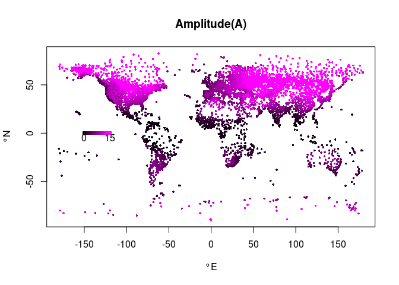
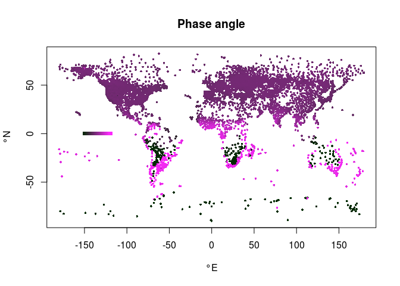
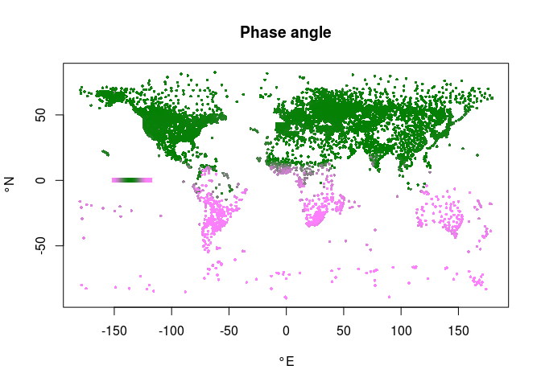
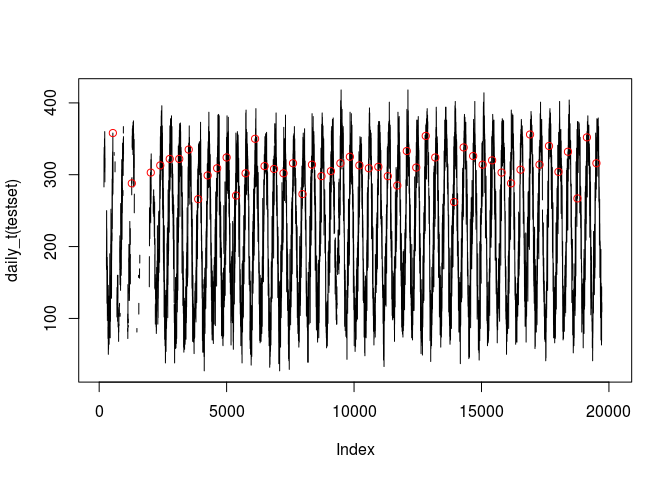
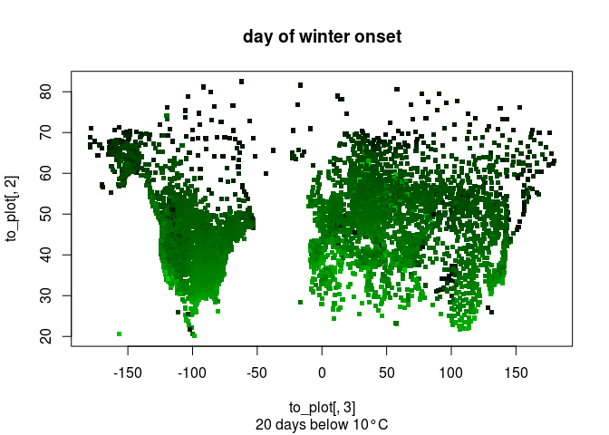
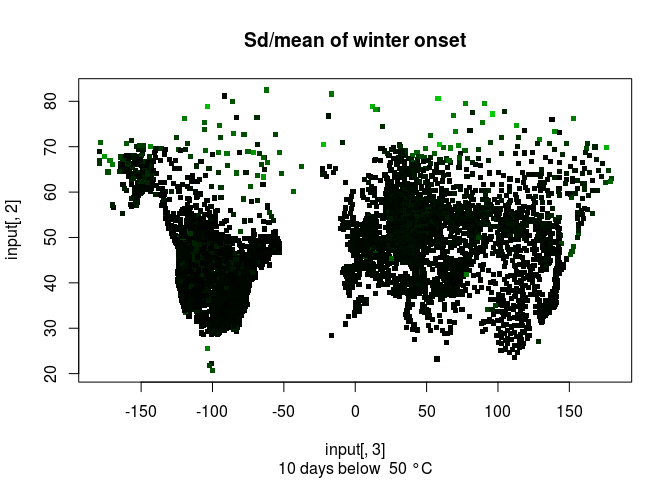
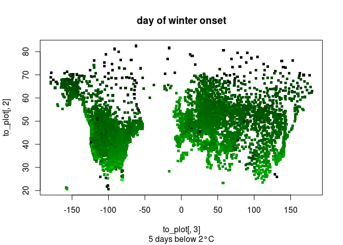
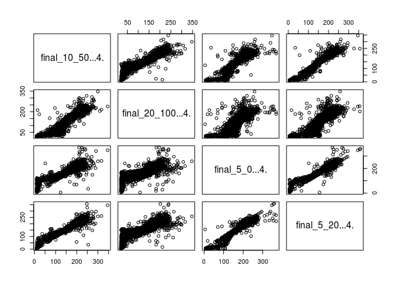

General description
===================

Aim
---

The aim of this project is to correlate climate variability with variability in seasonal timing. Is the slope in seasonal responses a bet-hedging trait, i.e., is it adaptive to spread one's timing in more variable conditions?

Overview
--------

This script uses data from the GHCN dataset, which was processed with a perl script (folder 001data\_conversion/conversion.pl), and has been merged with a climate station description from the NOAA server. This script first tests whether the climate data is read and processed correctly:

-   The data should (over all years) follow a sine-curve. Temperatures on the northern hemisphere should be highest around midsummer (june), and in the southern hemisphere highest during december.
-   Temperatures should generally increase with latitude, decrease with altitudes
-   the amplitude in temperature change should depend on latitude and continentality (proximity to oceans)

After the quality check the script calculates variability in winter onset for each station:

-   starting from each summer, count the number of cold days (defined as days with average temperature below y°C). Winter arrived at the x th cold day
-   calculate between-years variability in winter arrival

Specific description
--------------------

The data was generated with R version 3.4.3. It uses the GHCN-daily dataset by NOAA:

    ## [1] "The current version of GHCN Daily is 3.22-upd-2018010805 (i.e, an update that started at 2018010805 [yyyymmddhh] UTC; yyyy=year; mm=month; dd=day; hh=hour),"

Script
======

station metadata and subsetting
-------------------------------

``` r
load(paste(getwd(),"/02processing/001data_conversion/Rworkspace.RData",sep=""))
```

The name of the full dataset is 'newset'. The following chunk was used For testing purposes, selecting only a small subset ('testset'). For compatibility with the rest of the script, the dataset is now being renamed.

``` r
#testset<-newset[newset$lat>-20,]
#testset<-testset[testset$lat<60,]
#testset<-newset[newset$lon>(20),]
#testset<-testset[testset$lon<(30),]
#table(testset$ID)
#testset<-droplevels(testset)
testset<-newset  #renames newset so that the code below also works on the full dataset
rm(newset)
```

Quality control
---------------

The following part will append all data from one station to a single vector and make a non-linear least square regression. The data is expected to follow a sine curve with a period of ~1 year.

### Function for creating single vector

The function "daily\_t" will use the data provided by one station. It will append all daily temperature recordings of all years (up to 145 years \* 12 months \* 31 days ) into a single vector, filling up with NAs as needed.

``` r
daily_t <- function (station){
  station<-station[order(station[,2],station[,3],na.last=F),] #sorts by year and month
  station<-droplevels(station)
  if (length(unique(station$year))<3){vals<- (NA)} #quality control
  else {
    vals<-NA
    #for each year:
    for(y in 1:length(unique(station$year))){
      year<-station[station[,2]==unique(station[,2])[y],] #reduces dataset to 1 station, 1 year          (max 31*12 points)
      
      #make 12*31 matrix and fill it with daily data
      mat <- matrix(NA,12,31)
  
      for (i in 1:nrow(year)){ #i=month
        mon<-as.numeric(year[i,3])
        mat[mon,1:31]<-as.numeric(year[i,4:34])
      }
    vals<-c(vals,as.numeric(t(mat)))
    }
  return (vals)
  }
}
```

### Function for nonlinear least-square regression

The function 'get\_nls' takes the daily temperatures of one station (which is supplied as single vector), and applies a non-linear least squares model which estimates intercept, phase angle and amplitude of a sine curve.

``` r
get_nls <- function (vals,s_A=400,s_phi=pi/2,s_c=200){#s_... are starting values for nls function
  if (length(vals)==1){return (NA)} else{ #when there is insufficient data, the function daily_t will return "NA", so vals gets length 1. Otherwise vals will have length of at least 2*370(many of which may be NA)
  x<-1:length(vals)
  data<-data.frame(x,vals)

  #make nls regression for function 'y=Amplitude * cosine(period*x + phase angle) + intercept'
  res <- nls(vals ~ A*cos(x*2*pi/372+phi)+C, data=data, start=list(A=s_A,phi=s_phi,C=s_c),
            upper=c(500,2*pi,400),algorithm="port",lower=c(0,0,-400)) 
  #372 and not 365.25, because a vector of 12*31 was used before 
  #(filling up e.g. 31.feb with NA). This made coping with leap years easier

  co <- coef(res)
  return(co)
  }
}
```

### applying the functions on the dataset

The following chunk will apply a nls regression on the climate data of each station. The daily temperatures over ~20 years are expected to follow a sine-curve pattern with a period of 1 year. The curve is determined by the following parameters:
\* a *constant c* that defines the average temperature throughout the year. It is around 20°C in temperate climates, around 30°C at the equator.
\* the *amplitude A*, which quantifies the difference between winter and summer temperatures. A should decrease with proximity to the poles.
\* the *phase angle phi*. Phi defines at what time of the year maximum temperatures occur. It should be close to midsummer in all stations of the northern hemisphere, and around midwinter in the southern hemisphere. june 25 is the julian day 176/177. BEcause the function daily\_t assumes 12\*31 = 372 days, it is around day 170 in this dataset. This corresponds to a phase angle of 170/372 \*(2\*pi) = 2.87. The phase angle of midwinter is accordingly, 368/372\*(2\*pi)=6.22.

The function tries up to three times per climate station, with different starting parameters.

``` r
#,error=TRUE}
phi=NA
A=NA
C=NA
lat=NA
lon=NA
reg<-data.frame(lon,lat,A,phi,C)

wrap_error = function (vals,s_A,s_phi,s_c) {
  tryCatch(get_nls(vals,s_A,s_phi,s_c),
                     warning = function (w)  {return(FALSE)},
                     error   = function (e)  {return(FALSE)})
}

for (i in 1:length(unique(testset$ID))){ #= for each climate station

temp_set<-testset[testset$ID==unique(testset$ID)[i],]
vals<-daily_t(temp_set)
if (length(unique(vals))>100){ #insufficient number of years in functon daily_t will make length (vals)=1; but it is still possible that there are 3+ years filled with NA (less than 100 data points)

  parms<-wrap_error(vals,s_A=400,s_phi=pi/2,s_c=200)
  if (parms[1]==FALSE){parms<-wrap_error(vals,s_A=40,s_phi=pi,s_c=200)}#print ("retry1");
  if (parms[1]==FALSE){parms<-wrap_error(vals,s_A=40,s_phi=2*pi,s_c=200)}#print ("retry2");
  if (parms[1]==FALSE){print (paste("failed in ",i));parms<-c(-9999,-9999,-9999)}

} else  {
  parms<-rep(NA,5)
}
reg[i,1]<-temp_set[1,35] #longitude
reg[i,2]<-temp_set[1,36]# latitude
reg[i,3]<-parms[1] # Amplitude
reg[i,4]<-parms[2] #phase angle
reg[i,5]<-parms[3]#intercept
}
reg<-reg[is.na(reg[,3])==F,]
```

### Plotting the results:

1.  average Temperature

``` r
restore <- reg
reg$C[reg$C<(-200)]<-(-200) #caps some very low temperatures, makes plotting gradient nicer

plot(reg[,1]~reg[,2],bg=rgb(reg[,5]+abs(min(reg[,5])),1,reg[,5]+abs(min(reg[,5])),maxColorValue = max(reg[,5])+abs(min(reg[,5]))),pch=21,col=NA,cex=0.5,
     main = "Average temperature(C)",xlab="°E",ylab="°N")
for (i in seq(min(reg[,5]),max(reg[,5]),1)){
  points(x=-150 + i/10,y = 0, bg= rgb(i+abs(min(reg[,5])),1,i+abs(min(reg[,5])),maxColorValue = max(reg[,5])+abs(min(reg[,5]))),col=NA,pch=22)
}
text(-160,-5,min(reg$C)/10)
text(-110,-5,max(reg$C)/10)
```


``` r
#hist(reg[,5],breaks=100)
reg<-restore
#mean Temperature behaves as expected
```

1.  temperature amplitude

``` r
restore <- reg
reg$A[reg$A>150]<-150 #caps some very high amplitudes
plot(reg[,1]~reg[,2],bg=rgb(reg[,3],1,reg[,3],maxColorValue = max(reg[,3])),pch=21,col=NA,cex=0.5,
     main = "Amplitude(A)",xlab="°E",ylab="°N")
for (i in seq(0,max(reg[,3]),1)){
  points(x=-150 + i/5,y = 0,bg=rgb(i,1,i,maxColorValue = max(reg[,3])),col=NA,pch=22)
}#left: A = 0, right: A = 24°
text(-150,-5,0)
text(-120,-5,max(reg[,3]/10))
```



``` r
#hist(reg[,3])

reg<-restore
#amplitude is 0 at equator, as expected.
#amplitude increases northwards to >15° diff in summer-winter
#In south, there are only data points up to 20°S in this sample dataset, but the trend is the same
```

1.  phase angle

``` r
plot(reg[,1]~reg[,2],bg=rgb(reg[,4],1,reg[,4],maxColorValue = 2*pi),pch=21,col=NA,cex=0.5,
        main = "Phase angle",xlab="°E",ylab="°N")
for (i in seq(0,2*pi,0.1)){
  points(x=-150 + i*5,y = 0,bg=rgb(i,1,i,maxColorValue = 2*pi),col=NA,pch=22)
}#left: phi = 0, right: phi=2*pi
```



``` r
#hist(reg[,4])
#Due to the circular nature of the dataset, phase angles of phi=0 and phi=2*pi are equal. 
#better representation

plot(reg[,1]~reg[,2],bg=rgb(cos(reg[,4])+1,1,cos(reg[,4])+1,maxColorValue = 2),pch=21,col=NA,
       cex=0.5, main = "Phase angle",xlab="°E",ylab="°N")
for (i in seq(0,2*pi,0.1)){
  points(x=-150 + i*5,y = 0,bg=rgb(cos(i)+1,1,cos(i)+1,maxColorValue = 2),col=NA,pch=22)
}
```



``` r
#hist(cos(reg[,4]))

#phase angles behave as expected. mean of phi in the northern hemisphere:
mean(reg[,4][reg[,1]>20]) #this is shortly before midsummer
```

    ## [1] 2.779467

According to the subset, the data behaves just as expected.
\* amplitude decreases towards equator
\* amplitude is lower (less seasonality) at coastlines (e.g. Australia, west coast USA)
\* mean temperature increases towards equator
\* mean temperature drops in mountain ranges
\* phase angle is close to midsummer in northern latitudes, and -180° in southern latitudes

The remaining part of the script will be done on northern hemisphere only (&gt;20°N), as there is no empirical data for southern hemisphere.

calculate number of cold-days
-----------------------------

The location metadata has been erased in the meantime, because it takes quite a bit of memory. Reload it:

A bit of cleaning...

    ##             used  (Mb) gc trigger   (Mb)  max used   (Mb)
    ## Ncells    835201  44.7    1442291   77.1   1168576   62.5
    ## Vcells 124352696 948.8  192299748 1467.2 299982432 2288.7

### General idea

It is inconvenient that the year ends around midwinter. To calculate winter arrival, it makes more sense to have one "year" going from june to june:

``` r
plot(daily_t(testset),type="l")
#mean phase angle is at 2.78. 2.78/(2*pi)*372 =165 => highest temperature at day 165
points(x=165+372*(1:100),y= daily_t(testset)[165+372*(1:100)],col=2) #okay, dataset can be cut in this positiont
```



### How this is done

-   process data from one station to get a single temperature vector (there is already a function for that, called daily\_t)
-   get rid of the first half year (which lies before the first red dot), and of the last half year (this does not contain full 12 months of information)
-   reassemble the temperature vector into a matrix, with each row representing 12 months (june to june) of data.
-   For each year(row), count the number of days which have data
-   calculate winter onset for each year:
-   make a binomial matrix, with all T&lt;y = 1, all other T=0
-   calculate cumulative sums of each row
-   note the day where cum\_sum &gt; X
-   calculate standard deviation and mean winter onset, weighted by number of days with data

### Function to cut and reassemble into binomial matrix

This function takes the looong temperature vector of one station (daily temperature of several years), cuts the head and tail (half a year each), puts it back into matrix format (1 row = 1 year), and transforms it into a binomial matrix

``` r
reassemble_cd <- function (station,degrees=50){ #method to calculate winter onset based on accumulation of days cooler than 50centidegree (5°C)
  #expected input: a vector of length 372*n. Should be of the form: for n years{temperatures from (Jan to Dec)}. 372, because the function daily_t uses 12*31 days for calculation (filling up with NAs)
  
  #error handling
  if (length(station[is.na(station)==F])<100){
    return (NA) #error if <100 days in total
  } else if ((length(station)-1)%%372 !=0 ){
    print("ERROR")
    return(NA) #error if there are incomplete years
  } else if (length(station)<=754){
    print ("ERROR")
    return(NA)#error if there are <3 years
  } else{
    
    #cutting and reassembling
    station <- station[2:length(station)] #function daily_t() has appended an NA to each year in the beggining
    nyears <- length(station)/372 #should be an integer
    station<-station[165:(length(station)-208)] #temperatures from first winter to summer are irrelevant, calculation begins with first summer; the last year ends in december, but data would be needed until june-->last year cannot be used for calculations
    
    
    #conversion to binomial
    station[station<degrees]<-1
    station[station>1]<-0
    m<-matrix(station,(nyears-1),372,byrow=T)
    return(m) #output: a matrix with 372 cols, n-1 rows(first half of first year, and 2nd half of last year removed)
  }
}
```

### Function to calculate number of days with data

The script will later calculate the mean winter onset at each station. Because data quality differs among years, the mean needs to be weighted by the number of days with data per year. To do that, one needs to actually have the number of days:

``` r
row_na<-function (inp_matrix){
  navec<-NA #this means na_vector
  if (is.matrix(inp_matrix)==TRUE){
    navec <- rowSums(!is.na(inp_matrix))
   # for (i in 1:nrow(inp_matrix)){
   #   navec[i]<-length(inp_matrix[i,][is.na(inp_matrix[i,]==TRUE)])
   # }
  }
  return(navec)
}
```

### Function to test whether the cumulative sum of occurences of y reaches x = 10

``` r
calc_cumul <- function (inp_matrix,thres=10, conv_NA =TRUE){ #takes a matrix as input, calculates rowwise cumulative sums, and returns the position on which a threshold was first reached in each row 
  
  #input: any 2-dimensional matrix, a threshold
  #output: sum_vector
  
  #error handling
  if (is.matrix(inp_matrix)==FALSE){stop("no matrix provided in function calc_cumul")}
  if (conv_NA ==TRUE){
  vector<-is.na(inp_matrix)
  inp_matrix[vector]<-0
  }
  if (NA %in% inp_matrix){ #This part will only run if conv_NA ==F and there are nevertheless NA in the matrix
      stop("NA found in function calc_cumul. Try conv_NA=TRUE")
  }
  
  sum_vector <- rep(NA,nrow(inp_matrix))
  for (m_row in 1:nrow(inp_matrix)){
    temporary <-cumsum(inp_matrix[m_row,])
    if  (length(temporary[temporary==thres])>0){#only continue if threshold is reached
      sum_vector[m_row]<-min(which(temporary==thres))  #Cumsum increases 'from left to right' in the matrix. But if there are zeros in the original matrix, the cumsum may stay on one value, so threshold will occur several times in a row. the min() makes sure only the first value is taken 
    } #else{sum_vector stays NA}
  }
  return (sum_vector)
}
```

### Function that puts all these functions for one station together

``` r
do_all<-function(station,x=10,y=50){
  temp_set<-newset[newset$ID==unique(newset$ID)[station],] #read all data from one station
  
  vals<-daily_t(temp_set)#convert data frame into single vector: (day 1:372)*years
 #this returns: either a matrix, or NA
  
  n_t<-reassemble_cd(vals,y)# convert into binomial matrix of form {1:372}*(years-1)
  #this returns either a matrix or NA, input NA => output NA
  
  ndays<-row_na(n_t) #this vector describes how many temperature measurements are available per year for this station
  
  if ((is.null(nrow(n_t))==F) && (nrow(n_t)>1)){#calculation for this station only if functions "temp_set" and "reassemble" did not return {NA}
    out<- calc_cumul(n_t,x) #vector describing on which day y was reached for the xth time
  #error if no matrix as input, or if NA provided and setting conv_NA ==F
  }else{
    out<-NA
  }
  return(list(out,ndays))
}
```

### Function to calculate weighted means

The built-in function cannot handle NA

``` r
weighted_means<-function(resm,nm){ #calculate row-wise means of a matrix, weighted by another matrix, and ignoring any NAs
  ms<-rep(NA, nrow(resm))
  for (i in 1:nrow(resm)){
    worked<-which(!is.na(resm[i,1:ncol(resm)]))
    if (length(worked)>3){
      ms[i]<-weighted.mean(resm[i,worked[worked>3]],nm[i,worked[worked>3]])
    }
  }
  return(ms)
}
```

### wrapping function to run the code for all stations

``` r
loop_stations<-function(x=10,y=50){
#create a matrix:  9000 rows (1 for each station), 140 columns (1 for each year)+3 columns for ID,latitude, longitude. Each cell has the winter onset in one year
resmat<-matrix(NA,length(unique(newset$ID)),max(newset$year)-min(newset$year)+3)
nmat  <-matrix(NA,length(unique(newset$ID)),max(newset$year)-min(newset$year)+3)
lat_lon<-locations[locations$ID %in% sfile,1:3]
#table(sfile==lat_lon[,1])#always true
resmat<-as.data.frame(resmat)
nmat<-as.data.frame(nmat)
resmat[,1]<-sfile
resmat[,2]<-lat_lon[,2]
resmat[,3]<-lat_lon[,3]
nmat[,1:3]<-resmat[,1:3]
#loop through all stations, calculate winter onset given x and y values
for (station in 1:length(sfile)){
  r<-do_all(station,x,y)
  resmat[station,4:(length(r[[1]])+3)]<-r[[1]]
  nmat  [station,4:(length(r[[2]])+3)]<-r[[2]]
}

#store only ID,lat,lon,mean winter, sd(winter)
final<-resmat[,1:3]
final$means<-weighted_means(resmat,nmat)
return(final)
}
```

### running the actual code

This chunk tries 4 different parameter combinations

``` r
final_10_50<-loop_stations(x=10,y=50)
final_5_20<-loop_stations(x=5,y=20)
final_20_100<-loop_stations(x=20,y=100)
final_5_0<-loop_stations(5,0)
```

### plotting the results

``` r
plot_results<-function(input,sub){
  to_plot<-input[is.na(input$means)==FALSE,]
  plot(to_plot[,2]~to_plot[,3],bg=rgb(0,to_plot$means,0,maxColorValue=372),col=NA,main="day of winter onset",sub=sub,pch=22,cex=0.8)
}

plot_results(final_10_50,"10 days below 5°C")
```


``` r
plot_results(final_20_100,"20 days below 10°C")
```



``` r
plot_results(final_5_0,"5 days below 0°C")
```



``` r
plot_results(final_5_20,"5 days below 2°C")
```



These look quite similar...

``` r
mydat<-data.frame(final_10_50[,4],final_20_100[,4],final_5_0[,4],final_5_20[,4])
plot(mydat)
```


