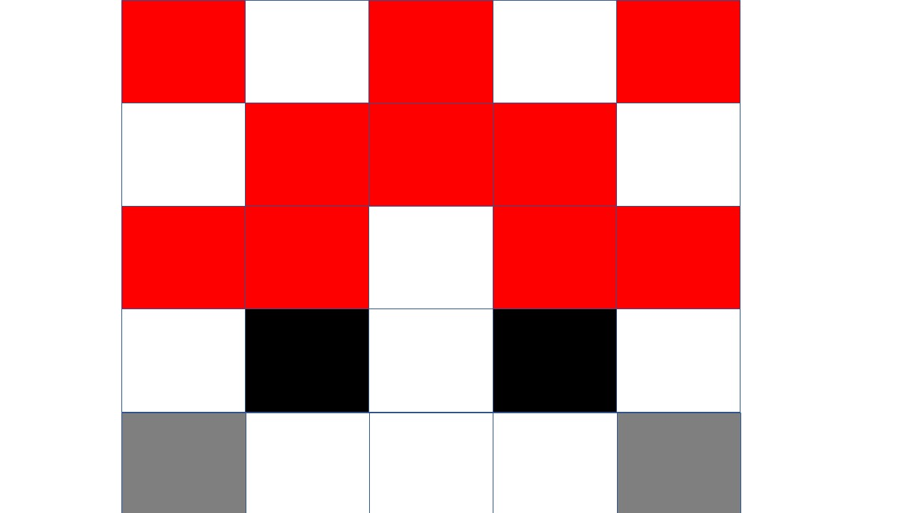

General description
===================

Aim
---

The aim of this project is to correlate climate variability with variability in seasonal timing. Is the slope in seasonal responses a bet-hedging trait, i.e., is it adaptive to spread one's timing in more variable conditions?

### Overview

This script uses data from the GHCN dataset, which was processed with a perl script (folder 001data\_conversion/conversion.pl), and has been merged with a climate station description from the NOAA server. This script calculates variability in winter onset for each station:

-   The data should (over all years) follow a sine-curve. Find the local maxima of this curve (summer)
-   starting from each summer, count the number of cold days (defined as days with average temperature below 5°C). Winter arrived at the 10th cold day
-   calculate circular variance in winter arrival

### Specific description

The data was generated with R version 3.4.3. It uses the GHCN-daily dataset by NOAA:

    ## [1] "The current version of GHCN Daily is 3.22-upd-2018010805 (i.e, an update that started at 2018010805 [yyyymmddhh] UTC; yyyy=year; mm=month; dd=day; hh=hour),"

### Script

``` r
load(paste(getwd(),"/02processing/001data_conversion/Rworkspace.RData",sep=""))
```

The name of the full dataset is 'newset'. For testing purposes, only a small subset ('testset') was used (e.g. 20-60°N, -1 to +1 °E).

``` r
#testset<-newset[newset$lat>-20,]
#testset<-testset[testset$lat<60,]
#testset<-newset[newset$lon>(20),]
#testset<-testset[testset$lon<(30),]
#table(testset$ID)
#testset<-droplevels(testset)
testset<-newset  #renames newset so that the code below also works on the full dataset
rm(newset)
```

The function "daily\_t" will use the data provided by one station. It will append all daily temperature recordings of all years (up to 145 years \* 12 months \* 31 days ) into a single vector, filling up with NAs as needed.

``` r
daily_t <- function (station){
  station<-station[order(station[,2],station[,3],na.last=F),] #sorts by year and month
  station<-droplevels(station)
  if (length(unique(station$year))<3){return (NA)} #quality control
  else {
    vals<-NA
    #for each year:
    for(y in 1:length(unique(station$year))){
      year<-station[station[,2]==unique(station[,2])[y],] #reduces dataset to 1 station, 1 year          (max 31*12 points)
      
      #make 12*31 matrix and fill it with daily data
      mat <- matrix(NA,12,31)
  
      for (i in 1:nrow(year)){ #i=month
        mon<-as.numeric(year[i,3])
        mat[mon,1:31]<-as.numeric(year[i,4:34])
      }
    vals<-c(vals,as.numeric(t(mat)))
    }
  return (vals)
  }
}
```

The function 'get\_nls' takes the daily temperatures of one station (which is supplied as single vector), and applies a non-linear least squares model which estimates intercept, phase angle and amplitude of a sine curve.

``` r
get_nls <- function (vals,s_A=400,s_phi=pi/2,s_c=200){#s_... are starting values for nls function
  if (length(vals)==1){return (NA)} else{ #when there is insufficient data, the function daily_t will return "NA", so vals gets length 1. Otherwise vals will have length of at least 2*370(many of which may be NA)
  x<-1:length(vals)
  data<-data.frame(x,vals)

  #make nls regression for function 'y=Amplitude * cosine(period*x + phase angle) + intercept'
  res <- nls(vals ~ A*cos(x*2*pi/372+phi)+C, data=data, start=list(A=s_A,phi=s_phi,C=s_c),
            # upper=c(500,2*pi,300),algorithm="port",lower=c(0,0,0)) 
            upper=c(500,2*pi,400),algorithm="port",lower=c(0,0,-400)) 
  #372 and not 365.25, because a vector of 12*31 was used before 
  #(filling up e.g. 31.feb with NA). This made coping with leap years easier

  co <- coef(res)
  return(co)
  }
}
```

The following chunk will apply a nls regression on the climate data of each station. The daily temperatures over ~20 years are expected to follow a sine-curve pattern with a period of 1 year. The curve is determined by the following parameters:
\* a *constant c* that defines the average temperature throughout the year. It is around 20°C in temperate climates, around 30°C at the equator.
\* the *amplitude A*, which quantifies the difference between winter and summer temperatures. A should decrease with proximity to the poles.
\* the *phase angle phi*. Phi defines at what time of the year maximum temperatures occur. It should be close to midsummer in all stations of the northern hemisphere, and around midwinter in the southern hemisphere. june 25 is the julian day 176/177. BEcause the function daily\_t assumes 12\*31 = 372 days, it is around day 170 in this dataset. This corresponds to a phase angle of 170/372 \*(2\*pi) = 2.87. The phase angle of midwinter is accordingly, 368/372\*(2\*pi)=6.22.

``` r
#,error=TRUE}
phi=NA
A=NA
C=NA
lat=NA
lon=NA
reg<-data.frame(lon,lat,A,phi,C)

wrap_error = function (vals,s_A,s_phi,s_c) {
  tryCatch(get_nls(vals,s_A,s_phi,s_c),
                     warning = function (w)  {return(FALSE)},#print(paste("warning at ", i))
                     error   = function (e)  {return(FALSE)})#print(paste("error at: ",i));
}

for (i in 1:length(unique(testset$ID))){ #= for each climate station

temp_set<-testset[testset$ID==unique(testset$ID)[i],]
vals<-daily_t(temp_set)
if (length(unique(vals))>100){ #insufficient number of years in functon daily_t will make length (vals)=1; but it is still possible that there are 3+ years filled with NA (less than 100 data points)

  parms<-wrap_error(vals,s_A=400,s_phi=pi/2,s_c=200)
  if (parms[1]==FALSE){parms<-wrap_error(vals,s_A=40,s_phi=pi,s_c=200)}#print ("retry1");
  if (parms[1]==FALSE){parms<-wrap_error(vals,s_A=40,s_phi=2*pi,s_c=200)}#print ("retry2");
  if (parms[1]==FALSE){print (paste("failed in ",i));parms<-c(-9999,-9999,-9999)}

} else  {
  parms<-rep(NA,5)
}
reg[i,1]<-temp_set[1,35] #longitude
reg[i,2]<-temp_set[1,36]# latitude
reg[i,3]<-parms[1] # Amplitude
reg[i,4]<-parms[2] #phase angle
reg[i,5]<-parms[3]#intercept
}
reg<-reg[is.na(reg[,3])==F,]
```

Plotting the results: 1. average Temperature

``` r
restore <- reg
reg$C[reg$C<(-200)]<-(-200) #caps some very low temperatures, makes plotting gradient nicer

plot(reg[,1]~reg[,2],bg=rgb(reg[,5]+abs(min(reg[,5])),1,reg[,5]+abs(min(reg[,5])),maxColorValue = max(reg[,5])+abs(min(reg[,5]))),pch=21,col=NA,cex=0.5,
     main = "Average temperature(C)",xlab="°E",ylab="°N")
for (i in seq(min(reg[,5]),max(reg[,5]),1)){
  points(x=-150 + i/10,y = 0, bg= rgb(i+abs(min(reg[,5])),1,i+abs(min(reg[,5])),maxColorValue = max(reg[,5])+abs(min(reg[,5]))),col=NA,pch=22)
}
text(-160,-5,min(reg$C)/10)
text(-110,-5,max(reg$C)/10)
```


``` r
hist(reg[,5],breaks=100)
```


``` r
reg<-restore
#mean Temperature behaves as expected
```

1.  temperature amplitude

``` r
restore <- reg
reg$A[reg$A>150]<-150 #caps some very high amplitudes
plot(reg[,1]~reg[,2],bg=rgb(reg[,3],1,reg[,3],maxColorValue = max(reg[,3])),pch=21,col=NA,cex=0.5,
     main = "Amplitude(A)",xlab="°E",ylab="°N")
for (i in seq(0,max(reg[,3]),1)){
  points(x=-150 + i/5,y = 0,bg=rgb(i,1,i,maxColorValue = max(reg[,3])),col=NA,pch=22)
}#left: A = 0, right: A = 24°
text(-150,-5,0)
text(-120,-5,max(reg[,3]/10))
```



``` r
hist(reg[,3])
```


``` r
reg<-restore
#amplitude is 0 at equator, as expected.
#amplitude increases northwards to >15° diff in summer-winter
#In south, there are only data points up to 20°S in this sample dataset, but the trend is the same
```

1.  phase angle

``` r
plot(reg[,1]~reg[,2],bg=rgb(reg[,4],1,reg[,4],maxColorValue = 2*pi),pch=21,col=NA,cex=0.5,
        main = "Phase angle",xlab="°E",ylab="°N")
for (i in seq(0,2*pi,0.1)){
  points(x=-150 + i*5,y = 0,bg=rgb(i,1,i,maxColorValue = 2*pi),col=NA,pch=22)
}#left: phi = 0, right: phi=2*pi
```


``` r
hist(reg[,4])
```


``` r
#Due to the circular nature of the dataset, phase angles of phi=0 and phi=2*pi are equal. 
#better representation

plot(reg[,1]~reg[,2],bg=rgb(cos(reg[,4])+1,1,cos(reg[,4])+1,maxColorValue = 2),pch=21,col=NA,
       cex=0.5, main = "Phase angle",xlab="°E",ylab="°N")
for (i in seq(0,2*pi,0.1)){
  points(x=-150 + i*5,y = 0,bg=rgb(cos(i)+1,1,cos(i)+1,maxColorValue = 2),col=NA,pch=22)
}
```


``` r
hist(cos(reg[,4]))
```


``` r
#phase angles behave as expected. mean of phi in the northern hemisphere:
mean(reg[,4][reg[,1]>20]) #this is shortly before midsummer
```

    ## [1] 2.779467

According to the subset, the data behaves just as expected.
\* amplitude decreases towards equator
\* amplitude is lower (less seasonality) at coastlines (e.g. Australia, west coast USA)
\* mean temperature increases towards equator
\* mean temperature drops in mountain ranges
\* phase angle is close to midsummer in northern latitudes, and -180° in southern latitudes

The remaining part of the script will be done on northern hemisphere only (&gt;20°N), as there is no empirical data for southern hemisphere. Next step: calculate number of cold-days
