issues
======

slopes.csv has typo in orius sauteri; and one order and spec missing tetranychidiae should be thromobiformes heteroptera-&gt;hemiptera

General description
===================

Aim
---

The aim of this project is to correlate climate variability with variability in seasonal timing. Is the slope in seasonal responses a bet-hedging trait, i.e., is it adaptive to spread one's timing in more variable conditions?

### Overview

Previous scripts calculated winter variability and winter predictability based on climate station data (30k stations), and various parameters of photoperiodic response curves from published studies (350 populations, 61 studies). This script analyses these datasets.

### Specific description

The data was generated with R version 3.4.4. It requires the datasets "01climate\_data/03output/results.txt" and "02studies/02output/slopes.txt", and the locations.txt file from the NOAA server. In a first attempt winter arrival was estimated to be on average on 30november; the physiological data then showed that insect diapause is at day lengths way earlier than that. The climate was calculated with new rules (different thresholds) and the fitting was repeated.

Script
======

General stuff
-------------

### Load the datasets

``` r
url<-"ftp://ftp.ncdc.noaa.gov/pub/data/ghcn/daily/ghcnd-stations.txt"
#this dataset is fixed-width delimited, requiring a few additional steps
locations<-read.fwf(
  file=url
  ,sep="!",na.strings=c("NA","-999.9"), #sep = ! because ! does not exist in dataset - > dataset is fixed-width and should have no additional separators
  widths=c(11, 9, 10, 7,2,35)
)
#reslist<-read.table("01climate_data/03output/results.txt",na.string = c("NA","-9999","-999.9"))  <-- this is with old thres of 5°C
reslist<-read.table("01climate_data/03output/results_94.txt",na.string = c("NA","-9999","-999.9"))
names(reslist)<-c("ID","meanwinter","sd_winter","nyears","p","A","phi","c","beta")
climate<-merge(locations,reslist,by=1)
rm(locations)
rm(reslist)
names(climate)<-c("ID","lat","lon","alt","no_idea","name","meanwinter","sd_winter", "nyears","p","A","phi","c","beta")

slopes<-read.table("02studies/02output/slopes.txt")
names(slopes)<-c("ID","b","b_se","c","c_se","d","d_se","e","e_se","ID2","study","pop","spec","order","degN","degE","py")
#quick-fixing typos
slopes$spec[slopes$spec=="Orius Sauteri"]<-"Orius sauteri"
slopes$spec[69]<-slopes$spec[68]
slopes$spec[70]<-slopes$spec[68]
slopes$order[69]<-slopes$order[68]
slopes$order[70]<-slopes$order[68]

slopes$order[slopes$order=="Tetranychidae"] <- "Trombidiformes"
slopes$order[slopes$order=="heteroptera"] <- "hemiptera"


climate<-climate[!is.na(climate$meanwinter),] #because these cannot be used anyway
climate$alt[climate$alt == -999.9]<-NA #was somehow not converted to NA during read.table
slopes<-separate(slopes,spec,c("g","s"),sep =" ",remove=FALSE)
slopes<-droplevels(slopes)
slopes$col<-as.numeric(slopes$order)#could find more beautiful way
slopes<-slopes[order(slopes$order,slopes$g,slopes$s,decreasing=T),]
slopes$real_se<-1/slopes$e_se #drc script inversed that, needs to be undone here.
slopes$b<-abs(slopes$b)

#174 data points, 28 studies, 26 species and 20 genera, 9 orders
#3 species are repeated in different studies, 
#one of the studies has three species
#each species is from diff genus except for diptera and tetranychus

 n<-table(slopes$order)#this table shows how many lines per order there are.
```

### functions

slighlity modified functions of forest.rma and forest.default (metafor). Forest.default now returns x-values and cex as well; everything is the same as the original version. Forest.rma now does not whiskers itself but lets user input whiskers size. The other two functions are hidden functions of the same package, which are required for the main function to run.

### statistical approaches

The "slopes" dataset contains different estimates (e.g. slope and inflection point) of 174 populations (population is the replicate here) in 30 studies, for 27 species, 21 genera and 10 orders. The correct statistical approach should be:

estimate ~ climate data, random = (study/species/genus/order),

with the estimate weighted by the inverse of its standard error. One could argue that study can be erased because it is almost entirely covered by species. I will try to keep it in though, because random effects with nearly 0 explained variance have no effect anyway. The only package (i am aware of) that can do the correct weighting is metafor, and it now also supports nested random terms.

What significance tests (if any) should be reported? p-values become difficult to calculate in this analysis, because it is nested, unbalanced and weighted, so conditional F-tests are no option (GLMM-Faq by ben bolker explains that well). likelihood-ratio test should work, though it might be inaccurate for small sample sizes. Using a bootstrap version that builds its own Chisquare-like distribution works only for lmer. P is problematic to defend for meta-analyses anyway, so I will not report it. Instead I will report the estimate of the coefficient with confidence interval (Wald-Type,because profile loglik and bootstrap are not available in metafor),I² + confidence interval, pseudo-R², a forest plot, and a plot of prediction + credible intervals. All models will be tested on the easier correlation of latitude and critical day length, and if working, applied to the correlation with predictability/variability.

Generally all outcome statistics are inaccurate, because they expect that variance of each point is known, but I only provide a coarse estimate of vairance that is based on a very low within-population sample size (~4-10 points to get a slope estimate). that needs to be discussed.

Critical day length and latitude
--------------------------------

### forest plots of CDL

This forest plot is just to get an overview how the dose-response curve modelling worked; it is not done on the actual meta-analytic model. The default option from package metafor does not allow colour-coding by order/species.

``` r
x<-mydeffor(x=slopes$e,sei=slopes$real_se,annotate=F,pch=22,col=1,bg=1:3,xlim=c(10,20),slab=NA,cex=1,rows=nrow(slopes):1, main = "Forest plot of CDL estimates (from DRC)",xlab="Critical day length") #rows=nrow:1 because it plots the data in reverse order
points(x=x[[9]],y=1:nrow(slopes),col=1,bg=slopes$col[nrow(slopes):1],pch=22,cex=x[[10]]+0.1)
#draw line for diff orders
cums<-cumsum(as.numeric(n))
abline(h=cums+0.5,lty=2,lwd=0.5)#draw line for diff orders

#print labels on left side, 1 for each order
#first, calculate y-value: midpoint of each order
cums<-c(0,cums)
c2<-NA
for(i in 1:(length(cums)-1)){
  c2[i]<-mean(c(cums[i],cums[i+1]))
}
text(x=5,y=c2,labels=names(n),pos=4,cex=0.8)
```

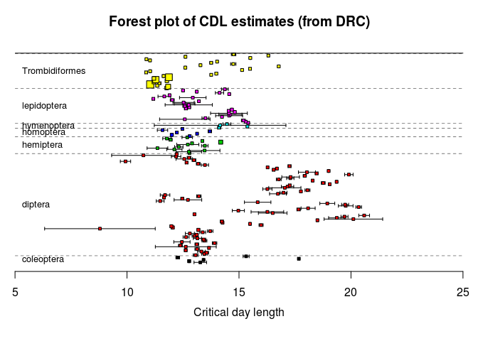

``` r
#text(x=5.5,y=cumsum(as.numeric(table(forest$order))),labels=c(1:7))
#need to play with colours so that each order has diff colour, but species within order also differ slightly
#also consider relevel orders so that large groups (diptera) are at bottom
```

### "influence" plot

This plot gave a good indication of s.e. of the slope estimates and distribution of cdls. But the s.e. does not go directly into the model, the weights are 1/s.e., and s.e. seems to be really small in some cases. Making a similar plot with "influence" instead of "error"

``` r
#hist(slopes$e_se,breaks=100) #despite its name this is not s.e. but inverse of s.e.
#truncate highest 5%
slopes$truncse<-1/slopes$real_se #actually that is influence, will be reversed in next lines
#length(slopes$e_se)*0.05 ~9
#length(slopes$e_se[slopes$e_se>260]) 9
slopes$truncse[slopes$truncse>260]<-260
slopes$truncse<-1/slopes$truncse
#alternative: exponential decline model
slopes$expse<-exp(slopes$real_se)

#plot untransformed s.e.
plot(NA,xlim=c(0,nrow(slopes)),ylim=c(0,2500),main = "influence of data points with untransformed s.e.")
segments(x0=1:nrow(slopes),y0=rep(0,nrow(slopes)),x1=1:nrow(slopes),y1=1/slopes$real_se,col=slopes$col,lwd=1.5)
```


``` r
#plot exp(s.e)
plot(NA,xlim=c(0,nrow(slopes)),ylim=c(0,1),main = "influence of data points with exp(s.e.)",xaxt="n",xlab="",ylab = "Influence")
segments(x0=1:nrow(slopes),y0=rep(0,nrow(slopes)),x1=1:nrow(slopes),y1=1/slopes$expse,col=slopes$col,lwd=1.5)
```


``` r
#plot truncated s.e.
plot(NA,xlim=c(0,nrow(slopes)),ylim=c(0,260),xaxt="n",xlab="",ylab = "Influence",main = "influence of data points with truncated s.e.)")
segments(x0=1:nrow(slopes),y0=rep(0,nrow(slopes)),x1=1:nrow(slopes),y1=1/slopes$truncse,col=slopes$order,lwd=1.5)
```


The exponential transform homogenized s.e. a lot!

### The model for latitude - CDL

The critical day length (day length at which 50 % of all offspring switch to diapause) should correlate with latitude. Earlier studies quote rates of 1-1.5 hours per 5°N. Let's see if that holds for the data in this meta-analysis.

#### a simple (but wrong) rma model (to test metafor)

#### the actual model

``` r
rmamod_nested<-rma.mv(yi = e ~ degN, V = expse, random = ~1|order/g/s/study, data = slopes,test="t")
summary(rmamod_nested) # species has no variance explained
```

    ## 
    ## Multivariate Meta-Analysis Model (k = 174; method: REML)
    ## 
    ##    logLik   Deviance        AIC        BIC       AICc  
    ## -260.6847   521.3695   533.3695   552.2544   533.8786  
    ## 
    ## Variance Components: 
    ## 
    ##             estim    sqrt  nlvls  fixed           factor
    ## sigma^2.1  0.5350  0.7314      7     no            order
    ## sigma^2.2  0.4877  0.6983     20     no          order/g
    ## sigma^2.3  0.0000  0.0001     26     no        order/g/s
    ## sigma^2.4  0.5135  0.7166     30     no  order/g/s/study
    ## 
    ## Test for Residual Heterogeneity: 
    ## QE(df = 172) = 291.1813, p-val < .0001
    ## 
    ## Test of Moderators (coefficient(s) 2): 
    ## F(df1 = 1, df2 = 172) = 126.1670, p-val < .0001
    ## 
    ## Model Results:
    ## 
    ##          estimate      se     tval    pval   ci.lb   ci.ub     
    ## intrcpt    6.8954  0.7274   9.4790  <.0001  5.4595  8.3312  ***
    ## degN       0.1617  0.0144  11.2324  <.0001  0.1333  0.1901  ***
    ## 
    ## ---
    ## Signif. codes:  0 '***' 0.001 '**' 0.01 '*' 0.05 '.' 0.1 ' ' 1

``` r
#profile(rmamod_nested, sigma2=1)#order
#profile(rmamod_nested, sigma2=2)#order/g
#profile(rmamod_nested, sigma2=3)#order/g/s #reaches maximum when set to 0
#profile(rmamod_nested, sigma2=4)#order/g/s/study
```

species explains nothing because in most cases each study has 1 species. Only in 4 species there are 2 studies, though in 1 study there are 3 species. removing study from the model ignores that the "2 studies of 1 species cases" should cluster (not reasonable), but also treats the 3 species within 1 study as independent (which is reasonable). Removing species rightly expects that studies of 1 species cluster (reasonable), but expects also that the 3 species of one study cluster (not reasonable). they can considered as equal, but because meta-analyses are expected to have study as random I prefer to kick out species. Profile plots of the reduced models:

#### alternative models

``` r
rmamod_rednested<-rma.mv(yi = e ~ degN, V = expse, random = ~1|order/g/study,data = slopes)
#profile(rmamod_rednested, sigma2=1)#order
#profile(rmamod_rednested, sigma2=2)#order/g #not much but okay
#profile(rmamod_rednested, sigma2=3)#order/g/study 

#comparing to lme and model without study
rmamod_rednested2<-rma.mv(yi = e ~ degN, V = expse, random = ~1|order/g/s,data = slopes)
#profile(rmamod_rednested2, sigma2=1)#order
#profile(rmamod_rednested2, sigma2=2)#order/g #better
#profile(rmamod_rednested2, sigma2=3)#order/g/s
```

#### results

Both are fine, so I stick to the one without species

``` r
rmamod_nested<-rmamod_rednested
summary(rmamod_nested)
```

    ## 
    ## Multivariate Meta-Analysis Model (k = 174; method: REML)
    ## 
    ##    logLik   Deviance        AIC        BIC       AICc  
    ## -260.6847   521.3695   531.3695   547.1069   531.7309  
    ## 
    ## Variance Components: 
    ## 
    ##             estim    sqrt  nlvls  fixed         factor
    ## sigma^2.1  0.5350  0.7314      7     no          order
    ## sigma^2.2  0.4877  0.6984     20     no        order/g
    ## sigma^2.3  0.5134  0.7166     30     no  order/g/study
    ## 
    ## Test for Residual Heterogeneity: 
    ## QE(df = 172) = 291.1813, p-val < .0001
    ## 
    ## Test of Moderators (coefficient(s) 2): 
    ## QM(df = 1) = 126.1675, p-val < .0001
    ## 
    ## Model Results:
    ## 
    ##          estimate      se     zval    pval   ci.lb   ci.ub     
    ## intrcpt    6.8954  0.7274   9.4790  <.0001  5.4696  8.3211  ***
    ## degN       0.1617  0.0144  11.2324  <.0001  0.1335  0.1899  ***
    ## 
    ## ---
    ## Signif. codes:  0 '***' 0.001 '**' 0.01 '*' 0.05 '.' 0.1 ' ' 1

``` r
#comparing to lmes
summary(lme(e~degN, random =~ 1|order/g/study,data=slopes,weights=~expse)) #very similar
```

    ## Linear mixed-effects model fit by REML
    ##  Data: slopes 
    ##        AIC      BIC    logLik
    ##   544.0762 562.9612 -266.0381
    ## 
    ## Random effects:
    ##  Formula: ~1 | order
    ##         (Intercept)
    ## StdDev:   0.7257216
    ## 
    ##  Formula: ~1 | g %in% order
    ##         (Intercept)
    ## StdDev:   0.7054425
    ## 
    ##  Formula: ~1 | study %in% g %in% order
    ##         (Intercept)  Residual
    ## StdDev:   0.7617773 0.8748472
    ## 
    ## Variance function:
    ##  Structure: fixed weights
    ##  Formula: ~expse 
    ## Fixed effects: e ~ degN 
    ##                Value Std.Error  DF  t-value p-value
    ## (Intercept) 6.984331 0.6939451 143 10.06467       0
    ## degN        0.159651 0.0134746 143 11.84826       0
    ##  Correlation: 
    ##      (Intr)
    ## degN -0.83 
    ## 
    ## Standardized Within-Group Residuals:
    ##         Min          Q1         Med          Q3         Max 
    ## -2.69895016 -0.46554480 -0.05699057  0.32734420  3.38745528 
    ## 
    ## Number of Observations: 174
    ## Number of Groups: 
    ##                   order            g %in% order study %in% g %in% order 
    ##                       7                      20                      30

``` r
#summary(lme(e~degN ,random=~ 1|order/g/s/study,data=slopes, weights= ~expse))

#1. estimate +ci
confint(rmamod_nested,fixed=T,random=F)
```

    ## 
    ##         estimate  ci.lb  ci.ub
    ## intrcpt   6.8954 5.4696 8.3211
    ## degN      0.1617 0.1335 0.1899

``` r
#2. I² 
W <- diag(1/slopes$expse)
X <- model.matrix(rmamod_nested)
P <- W - W %*% X %*% solve(t(X) %*% W %*% X) %*% t(X) %*% W #generalized calculation of I² as described in http://www.metafor-project.org/doku.php/tips:i2_multilevel_multivariate
#overall I² (using sum of sigmas)

100 * sum(rmamod_nested$sigma2) / (sum(rmamod_nested$sigma2) + (rmamod_nested$k-rmamod_nested$p)/sum(diag(P)))
```

    ## [1] 58.3729

``` r
#I² of each level
round(100 * rmamod_nested$sigma2 / (sum(rmamod_nested$sigma2) + (rmamod_nested$k-rmamod_nested$p)/sum(diag(P))),4)
```

    ## [1] 20.3301 18.5322 19.5105

``` r
#heterogeneity makes up 57% of overall variance, order,genus,study have 20,8, and 29%


#3. forest plot #this version plots predictions + CI as whiskers
notneeded<-function(){
  fore<-data.frame(ps$pred,ps$ci.lb,ps$ci.ub,r2$order,r2$g,r2$s,r2$study,r2$col,r2$degN,r2$e)
fore<-fore[order(fore$r2.order,fore$r2.g,fore$r2.s,fore$r2.study,decreasing=F),]
fore$ord<-1:nrow(fore)
plot(y=1:nrow(forest), x=fore$ps.pred, xlim=c(8,21), pch=22, cex=0.8, main = "Forest plot of CDL estimates", xlab = "Critical day length", yaxt="n", ylab="", bg=fore$r2.col, col=NA)
abline(v=0,lty=3,col="darkgrey")
arrows(x0=fore$ps.ci.ub, y0=1:nrow(forest), x1=fore$ps.ci.lb, length=0, col=1, lwd=1.5)
abline(h=cumsum( as.numeric(table(fore$r2.order)))+0.5,lty=2,lwd=0.5)#draw line for diff orders
}

#forest plot sorted by order 
yi<-rmamod_nested$yi
vicorr<-slopes[nrow(slopes):1,"real_se"]

ci.ub<-yi + qnorm(0.05/2, lower.tail = FALSE) * sqrt(vicorr)
ci.lb<-yi - qnorm(0.05/2, lower.tail = FALSE) * sqrt(vicorr)
ci.ub<-ci.ub[length(ci.ub):1]
ci.lb<-ci.lb[length(ci.lb):1]
x<-myfor(rmamod_nested,addcred=T,addfit=T,cex.axis=1,cex.lab=2,cex=0.5,xlim=c(6,25),alim=c(8,23),slab=NA,annotate=F,ci.ub=ci.ub,ci.lb=ci.lb,order=1:174, main = "Forest plot, sorted by phylogeny",xlab = "CDL")
#this plot shows: original CDL as black square, credible interval of fitted value as grey polygon, whiskers based on original s.e. (standard function would use exp(s.e.))

#needs cex of each point
text(x=7,y=c2,labels=names(n),pos=4,cex=0.8)
abline(h=cums+0.5,lty=2,lwd=0.5)#draw line for diff orders
points(rmamod_nested$yi,174:1,bg=slopes$col,cex=0.8,pch=22)
```

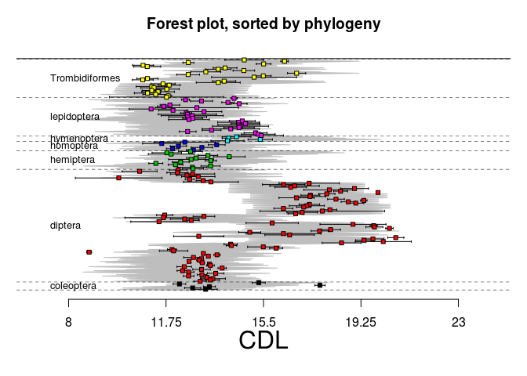

``` r
#forest plot sorted by degN
yi<-rmamod_nested$yi
yi<-yi[order(slopes$degN)]
vicorr<-slopes[nrow(slopes):1,"real_se"]
vicorr<-vicorr[order(slopes$degN)]
ci.ub<-yi + qnorm(0.05/2, lower.tail = FALSE) * sqrt(vicorr)
ci.lb<-yi - qnorm(0.05/2, lower.tail = FALSE) * sqrt(vicorr)
ci.ub<-ci.ub[length(ci.ub):1]
ci.lb<-ci.lb[length(ci.lb):1]
x<-myfor(rmamod_nested,addcred=T, addfit=T, cex.axis=1, cex.lab=2, cex=0.5, xlim=c(6,25), alim=c(8,23), slab=NA, annotate=F, ci.ub=ci.ub, ci.lb=ci.lb, order=order(slopes$degN),main = "Forest plot, sorted by latitude",xlab = "CDL")
points(yi,174:1,bg=slopes$col[order(slopes$degN)],cex=0.8,pch=22)
```


``` r
#4. pseudo-R^2
pseudo_nested<-rma.mv(yi = e ~ 1, V = expse, random = ~1|order/g/study,data = slopes,test="t")
rsq<-(sum(pseudo_nested$sigma2)-sum(rmamod_nested$sigma2))/sum(pseudo_nested$sigma2)
#0.60


#6. plot prediction + credible interval
ps<-predict.rma(rmamod_nested)

normal<- data.frame(slopes$degN,ps$cr.lb,ps$ci.lb)
names(normal)<-c("degN","cr","ci")
normal<-normal[order(normal$degN),]
reversed<-data.frame(slopes$degN,ps$cr.ub,ps$ci.ub)
names(reversed)<-c("degN","cr","ci")
reversed<-reversed[order(reversed$degN),]
reversed<-reversed[nrow(reversed):1,]
combined<-rbind(normal,reversed)
names(combined)<-c("degN","cr","ci")

plot(x=slopes$degN,y=slopes$e,pch=21,cex=0.8,col=NA, bg=slopes$col,main = "Delay in photoperiodic response vs latitude", xlab = "Latitude (°N)", ylab = "Critical photoperiod")
legend("topleft",pch = 21, pt.bg = 1:7,legend=unique(slopes$order)[7:1],cex=0.8)
polygon(x=combined$degN, y=combined$cr,col="lightgrey",border=NA)
polygon(x=combined$degN, y=combined$ci,col="darkgrey",border=NA)
lines(x=slopes$degN,y=ps$pred,lwd=2)
points(x=slopes$degN,y=slopes$e,pch=21,cex=0.8,col=NA,bg=slopes$col)
ci.lb<-ci.lb[length(ci.lb):1]
ci.ub<-ci.ub[length(ci.ub):1]
segments(x0=slopes$degN[order(slopes$degN)],x1=slopes$degN[order(slopes$degN)],y0=ci.lb,y1=ci.ub)
#segments(x0=slopes$degN,x1=slopes$degN,y0=slopes$e+slopes$real_se,y1=slopes$e-slopes$real_se)
axis(1)
s_est<-confint(rmamod_nested,fixed=T,random=F)$fixed[2,1]*5
s_est<-round(s_est,2)
rsq=round(rsq,2)
#5 degrees latitude ~ 1 hour
text(50,20,paste("slope = ",s_est, " hours/5°N\npseudo-R² = ",rsq),cex=0.8)
```

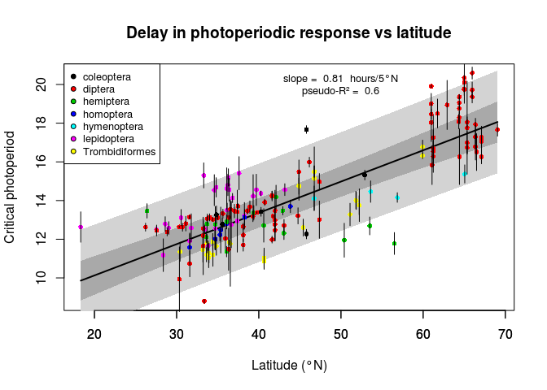

#### alternative plot of results

making the same plot as last one, but with lines for each study

The estimate of 1 h per 5° N is not too bad, overall diapause becomes 49 min earlier per 5°.

Climate data
------------

The things so far tested only CDL vs latitude, implying that mean winter is a function of latitude. A better way would be to test CDL directly vs winter onset. And then there is of course the question how slopes correlate with climate variables. So the next step is to look at the climate data.

### overview

This section correlates the climate variables against each other, and plots them on a global map.

#### mean winter and latitude

``` r
plot(climate$meanwinter~climate$lat,pch=22,cex=0.1, main ="Mean winter onset vs. latitude")
```

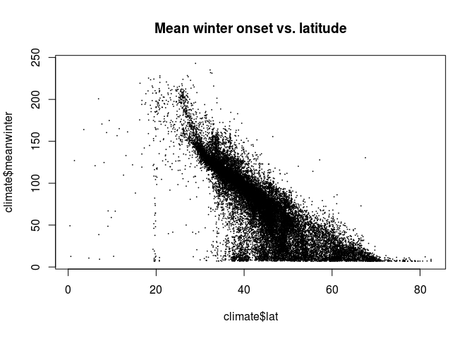

``` r
hist(slopes$degN,breaks=100)
```


It is possibly a bad idea to use any climate above 70°N. The highest latitude in the studies was 69.05 °N. The apparent cap at ~25°N is because winter is not defined for warm climates (winter never arrives). The lowest latitude in the studies is at 18.3°N. \#\#\#\# Refined overview:

``` r
climate<-climate[climate$lat<=70,]
plot(climate$meanwinter~climate$lat,pch=22,cex=0.1, main ="Mean winter onset vs. latitude")
```

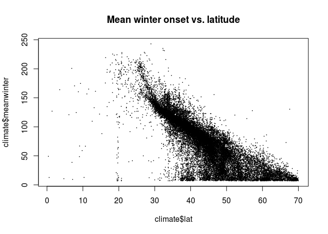

``` r
M<-lm(climate$meanwinter~climate$lat)
```

#### expected CDL shifts

Mean winter decreases by 3.8 days per ° latitude = 19 days per 5°, so an organism needs to react to a day length equal to 19 days earlier in the year per 5°N. The correct calculation of day length at a given latitude for a given day is difficult: <https://en.wikipedia.org/wiki/Sunrise_equation> luckily there is a package that solves that.

``` r
M<-lm(climate$meanwinter~climate$lat)
#expected_dl = daylength(latitude,day)
#with day = day from regression on M +182 days because the "year" calculated from climate data starts in july

climate$expdl<-daylength(climate$lat,climate$meanwinter+182)
#the switch to diapause usually takes some time, e.g. sexual offspring must be produced and mature. lets try 1 - 3 weeks
climate$expdl7<-daylength(climate$lat,climate$meanwinter+182-7)
climate$expdl14<-daylength(climate$lat,climate$meanwinter+182-14)
climate$expdl21<-daylength(climate$lat,climate$meanwinter+182-21)

plot(climate$expdl~climate$lat,pch=22,cex=0.1,bg=1, main = "expected day length response",xlab = "Latitude",ylab = "Expected day length given latitude and winter onset")
```


``` r
#plot(climate$expdl7~climate$lat,pch=22,cex=0.1,bg=2,main = "expected day length response \nwith 7 days delay")
#plot(climate$expdl14~climate$lat,pch=22,cex=0.1,bg=3,main = "expected day length response\nwith 14 days delay")
plot(climate$expdl21~climate$lat,pch=22,cex=0.1,bg=4,main = "expected day length response\nwith 21 days delay",xlab = "Latitude",ylab = "Expected day length given latitude and winter onset")
```


#### some histograms

``` r
hist(climate$alt)
```


``` r
climate$sq_alt <-sqrt(climate$alt) #few NAs producded
```

    ## Warning in sqrt(climate$alt): NaNs produced

``` r
hist(climate$sq_alt,breaks=100)
```


``` r
hist(climate$meanwinter,breaks=100)
```


``` r
hist(climate$sd_winter,breaks=100)
```


``` r
climate$capped_sd<-climate$sd_winter
climate$capped_sd[climate$capped_sd>50]<-50

hist(climate$nyears,breaks=50)
```

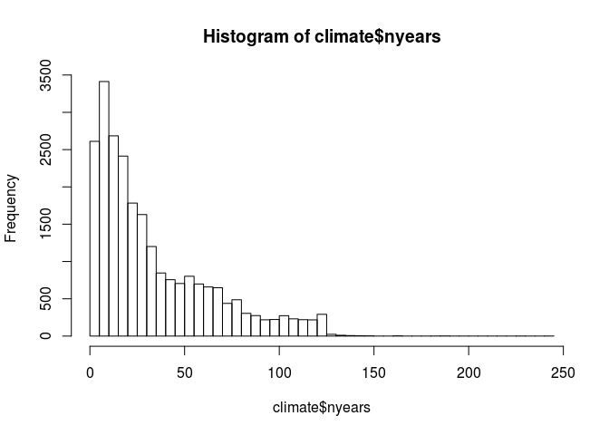

``` r
hist(climate$beta,breaks=100)#this is considerably less than in vasseur & Yodzis!
```


``` r
hist(climate$p)
```

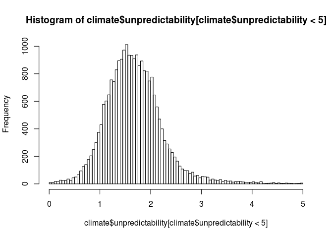

``` r
hist(climate$p[climate$p<5],breaks=100) #99.99 %
```

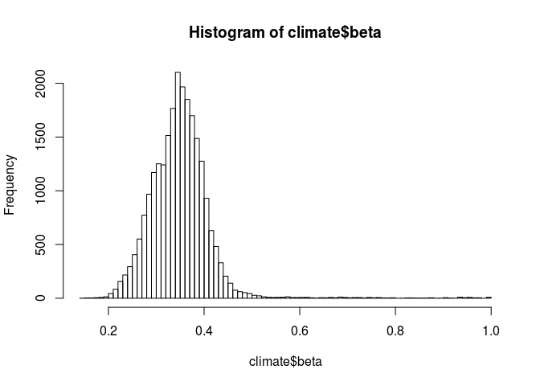

#### histograms for nls regression

### Visualisation

#### global view of nls results

#### mean winter, sd(winter), predictability, beta

``` r
#png("mean-winter.png")
p<-climate
p<-p[!is.na(p$meanwinter),]
plot(p$lat~p$lon,bg = rgb(p$meanwinter,p$meanwinter,0,maxColorValue = max(p$meanwinter)),cex=0.3,pch=22,col=NA, main ="mean winter onset",xlab="",ylab="")
```


``` r
#dev.off()

p<-climate
p<-p[!is.na(p$capped_sd),]
p$capped_sd[p$capped_sd>20]<-20
p<-p[p$nyears>8,]
#png("sd-winter.png")
plot(p$lat~p$lon,bg = rgb(p$capped_sd,p$capped_sd,0,maxColorValue = max(p$capped_sd)),cex=0.3,pch=22,col=NA, main ="sd winter onset, capped at 20",xlab="",ylab="")
```

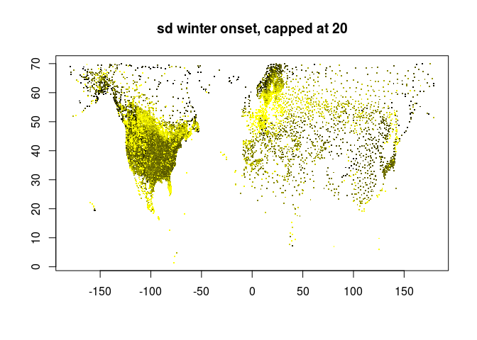

``` r
#dev.off()


p<-climate[climate$nyears>25,]
p<-p[!is.na(p$beta),]
p$beta[p$beta>1.2]<-1.2 #0.42% of all data
p$beta[p$beta>1]<-1
p$beta[p$beta<0]<-0 #1.99%


#png("predictability-beta.png")
plot(p$lat~p$lon,bg = rgb(1,max(p$beta)-p$beta,max(p$beta)-p$beta,maxColorValue =1),cex=0.3,pch=22,col=NA, main ="predictability (beta)",xlab="",ylab="")
```

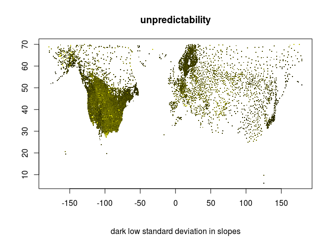

``` r
#dev.off()
#or to have the same colour:
plot(p$lat~p$lon,bg = rgb(p$beta,p$beta,0,maxColorValue = max(p$beta+0.001)),cex=0.3,pch=22,col=NA, main ="predictability (beta)",xlab="",ylab="")
```

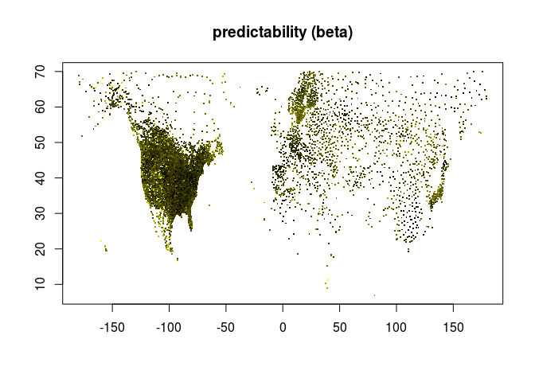

``` r
#dev.off()


p<-climate[climate$nyears>25,]
p<-p[!is.na(p$p),]
p<-p[p$p<5,] #99.7%
#range(p$unpredictability)
#png("predictability-winter.png")
plot(p$lat~p$lon,bg = rgb(p$p,p$p,0,maxColorValue = max(p$p+0.001)),cex=0.3,pch=22,col=NA, main ="predictability (sd slopes)",sub="dark low standard deviation in slopes",xlab="",ylab="")
```

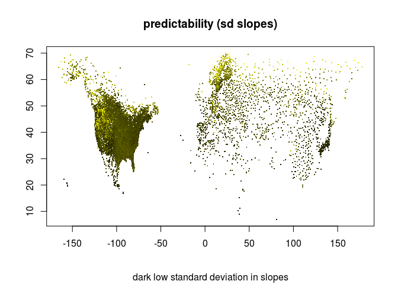

``` r
#dev.off()
```

#### correlations of sd/predictabiltiy with environmental variables

``` r
p<-climate
p$A[p$A>250]<-250
p$p[p$p>5]<-5
plot(p$capped_sd~p$lat,pch=22,cex=0.1)
```


``` r
plot(p$capped_sd~p$sq_alt,pch=22,cex=0.1)
```


``` r
plot(p$capped_sd~p$A,pch=22,cex=0.1)
```


``` r
plot(p$capped_sd~p$meanwinter,pch=22,cex=0.1)
```


``` r
plot(p$p~p$lat,pch=22,cex=0.1)
```


``` r
plot(p$p~p$sq_alt,pch=22,cex=0.1)
```


``` r
plot(p$p~p$A,pch=22,cex=0.1)
```


``` r
plot(p$p~p$meanwinter,pch=22,cex=0.1)
```


``` r
p$beta[p$beta<0]<-0
p$beta[p$beta>1]<-1
plot(p$beta~p$lat,pch=22,cex=0.1)
```


``` r
plot(p$beta~p$sq_alt,pch=22,cex=0.1)
```


``` r
plot(p$beta~p$A,pch=22,cex=0.1)
```


``` r
plot(p$beta~p$meanwinter,pch=22,cex=0.1)
```


``` r
#summary(lm(p$p~p$lat+p$lon+p$sq_alt))
#summary(lm(p$beta~p$lat+p$lon+p$alt))
#summary(lm(p$capped_sd~p$lat+p$lon+p$sq_alt))
```

#### correlation of variability/predictability with each other

``` r
plot(p$capped_sd~p$p,pch=22,cex=0.1)
```


``` r
plot(p$capped_sd~p$beta,pch=22,cex=0.1)
```


``` r
plot(p$p~p$beta,pch=22,cex=0.1)
```


combining empirical data and climate
------------------------------------

Empirical studies were not necessarily done close to a climate station. To estimate climate at a given study location, I take the average of the 5 closest stations, weighted by euclidian distance. \#\#\# combining

``` r
slopes$meanwinter<-NA
slopes$sd_winter<-NA
slopes$unpredictability<-NA
slopes$nyears<-NA
slopes$beta<-NA 

for ( i in 1:nrow(slopes)){
  #reduce to +-5 °
  sub<-climate[between(climate$lat,slopes[i,"degN"]-5,slopes[i,"degN"]+5)& between(climate$lon,slopes[i,"degE"]-5,slopes[i,"degE"]+5),]
  
  sub$diffN<-sub$lat-slopes[i,"degN"] #calculate distance in latitude
  sub$diffE<-sub$lon-slopes[i,"degE"] #same for longitude
  sub$diff<-sqrt(sub$diffN^2+sub$diffE^2) #euclidian distance
      #test whether this works
#  plot(sub$lat~sub$lon,pch=22,bg=rgb(1,sub$diff,1,maxColorValue = max(sub$diff)))


  sub<-arrange(sub,diff)[1:5,] #sort and take 5 lowest values
  

  
  slopes$meanwinter[i]<-weighted.mean(sub$meanwinter,1/sub$diff)
  slopes$sd_winter[i]<-weighted.mean(sub$sd_winter,1/sub$diff)
  slopes$p[i]<-weighted.mean(sub$p,1/sub$diff)
  slopes$nyears[i]<-weighted.mean(sub$nyears,1/sub$diff)
  slopes$beta[i]<-weighted.mean(sub$beta,1/sub$diff)

}

slopes<-slopes[!is.na(slopes$meanwinter),]
```

### visualising

``` r
#empty map
p<-climate
p<-p[!is.na(p$meanwinter),]
plot(p$lat~p$lon,bg = rgb(0.8,0.8,0.8,maxColorValue =1),cex=0.3,pch=22,col=NA, main ="Study locations",xlab="",ylab="")
points(slopes$degN~slopes$degE,pch=22,bg=1,cex=0.2)
```

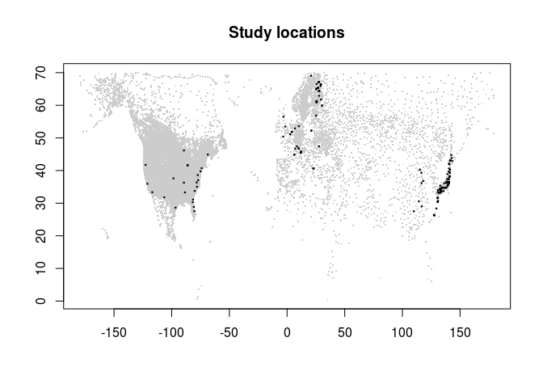

``` r
#test whether euclidian distance did something bad
plot(p$lat~p$lon,bg = rgb(p$meanwinter,p$meanwinter,0,maxColorValue = max(p$meanwinter)),cex=0.3,pch=22,col=NA, main ="mean winter onset",xlab="",ylab="")
points(slopes$degN~slopes$degE,pch=22,bg=rgb(slopes$meanwinter,slopes$meanwinter,0,maxColorValue = max(p$meanwinter)),cex=0.5,col=NA)
```

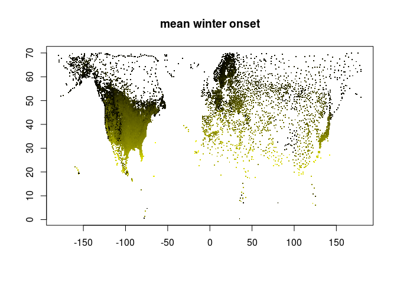

``` r
#points are invisible, so the yblend perfectly with the other data


#visualizing variability/predictability of study locations


slopes$temp<-slopes$meanwinter
plot(p$lat~p$lon,bg = rgb(0.8,0.8,0.8),cex=0.3,pch=22,col=NA, main ="mean winter",xlab="",ylab="")
points(slopes$degN~slopes$degE,pch=22,bg=rgb(slopes$temp,slopes$temp,0,maxColorValue = max(slopes$temp)),cex=0.5,col=NA)
```

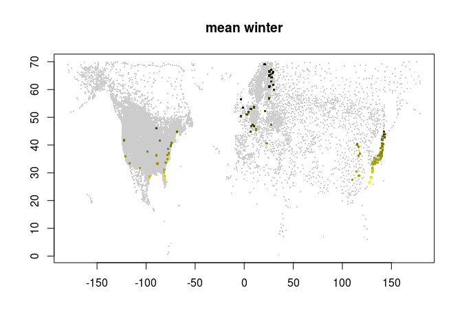

``` r
slopes$temp<-slopes$sd_winter
slopes$temp[slopes$temp>50]<-50
plot(p$lat~p$lon,bg = rgb(0.8,0.8,0.8),cex=0.3,pch=22,col=NA, main ="sd(winter)",xlab="",ylab="")
points(slopes$degN~slopes$degE,pch=22,bg=rgb(slopes$temp,slopes$temp,0,maxColorValue = max(slopes$temp)),cex=0.5,col=NA)
```

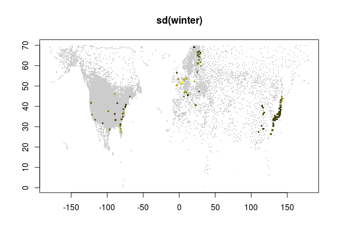

``` r
slopes$temp<-slopes$p
p<-p[!is.na(p$p),]
x<-slopes[!is.na(slopes$p),]
plot(p$lat~p$lon,bg = rgb(0.8,0.8,0.8),cex=0.3,pch=22,col=NA, main ="predictability(slopes)",xlab="",ylab="")
points(x$degN~x$degE,pch=22,bg=rgb(x$temp,x$temp,0,maxColorValue = max(x$temp)),cex=0.5,col=NA)
```

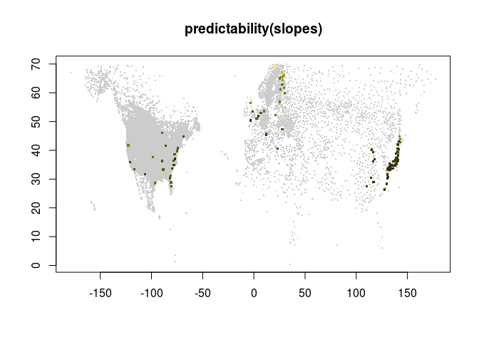

``` r
slopes$temp<-slopes$beta
slopes$temp[slopes$temp<0]<-0
plot(p$lat~p$lon,bg = rgb(0.8,0.8,0.8),cex=0.3,pch=22,col=NA, main ="predictability (beta)",xlab="",ylab="")
points(slopes$degN~slopes$degE,pch=22,bg=rgb(slopes$temp,slopes$temp,0,maxColorValue = max(slopes$temp)),cex=0.5,col=NA)
```

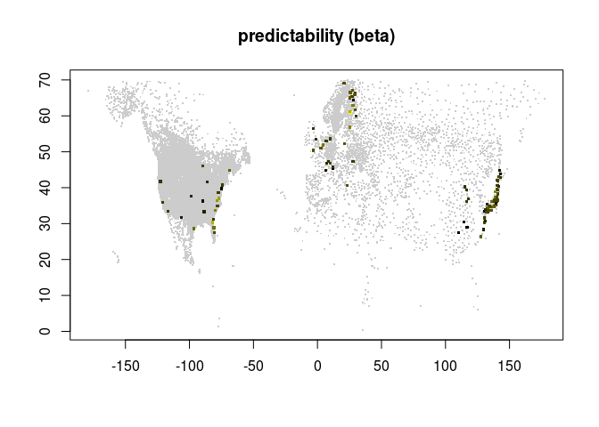

``` r
slopes$temp<-slopes$b
plot(p$lat~p$lon,bg = rgb(0.8,0.8,0.8),cex=0.3,pch=22,col=NA, main ="b",xlab="",ylab="")
points(slopes$degN~slopes$degE,pch=22,bg=rgb(slopes$temp,slopes$temp,0,maxColorValue = max(slopes$temp)),cex=0.8,col=NA)
```

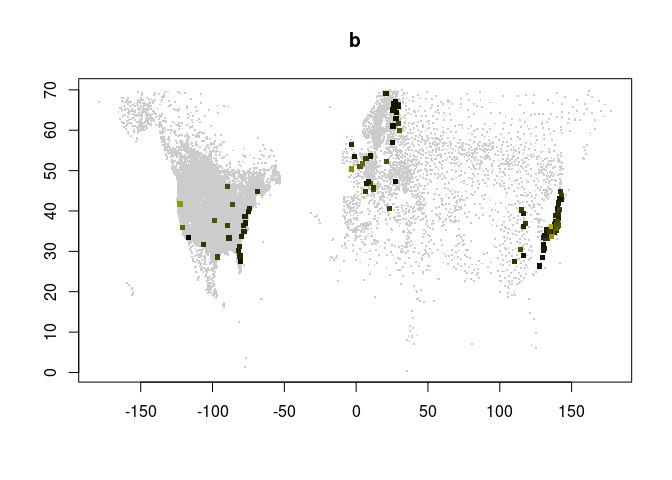

#### combining CDL curve with expectation

CDL estimates were in a first attempt consistently earlier than day length at mean winter. When the script is run with results.txt, the following chunk shows that winter onset should be shifted to 30 aug. When run with results\_94.txt it shows that the match is reasonably accurate (though it would be beneficial to shift it by further 40 days.

``` r
slopes<-slopes[order(slopes$degN),]

plot(slopes$degN,slopes$e)
points(slopes$degN,daylength(slopes$degN,slopes$meanwinter+180),pch=22,bg=2,col=NA)
```

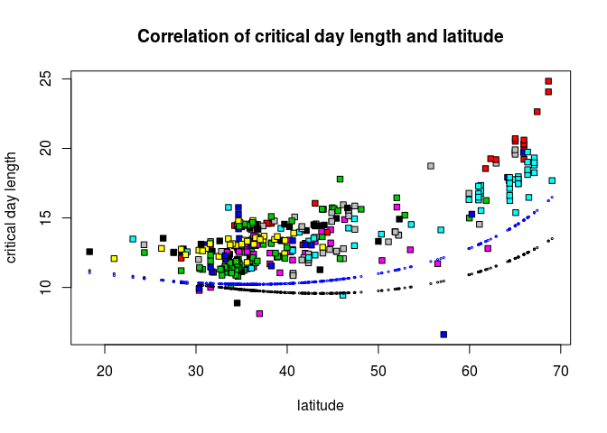

``` r
#this fit is not particularly nice. One would expect that these two values correlate tightly, and also that the intercept is the same (i.e. e should not be consistently earlier than the expectation)
dl<-daylength(slopes$degN,slopes$meanwinter+180)
plot(dl~slopes$e)
M<-lm(dl~slopes$e - 1)
abline(M)
```

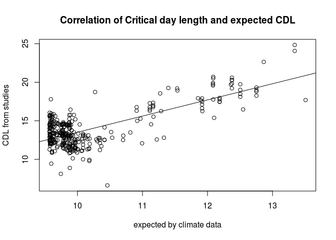

``` r
#expectation and observed values clearly do not match.
#actually this makes sense because the organism has to prepare before winter onset, so the expected dl should be the day length of winter onset minus some unknown constant. Let us try all 365 constants and see which model fits best. 

ks<-rep(NA,365)
for ( i in 1:365){
  dl<-daylength(slopes$degN,slopes$meanwinter+180-i)
  ks[i]<-ks.test(dl,slopes$e)$statistic
}
```

    ## Warning in ks.test(dl, slopes$e): p-value will be approximate in the
    ## presence of ties

    ## Warning in ks.test(dl, slopes$e): p-value will be approximate in the
    ## presence of ties

    ## Warning in ks.test(dl, slopes$e): p-value will be approximate in the
    ## presence of ties

    ## Warning in ks.test(dl, slopes$e): p-value will be approximate in the
    ## presence of ties

    ## Warning in ks.test(dl, slopes$e): p-value will be approximate in the
    ## presence of ties

    ## Warning in ks.test(dl, slopes$e): p-value will be approximate in the
    ## presence of ties

    ## Warning in ks.test(dl, slopes$e): p-value will be approximate in the
    ## presence of ties

    ## Warning in ks.test(dl, slopes$e): p-value will be approximate in the
    ## presence of ties

    ## Warning in ks.test(dl, slopes$e): p-value will be approximate in the
    ## presence of ties

    ## Warning in ks.test(dl, slopes$e): p-value will be approximate in the
    ## presence of ties

    ## Warning in ks.test(dl, slopes$e): p-value will be approximate in the
    ## presence of ties

    ## Warning in ks.test(dl, slopes$e): p-value will be approximate in the
    ## presence of ties

    ## Warning in ks.test(dl, slopes$e): p-value will be approximate in the
    ## presence of ties

    ## Warning in ks.test(dl, slopes$e): p-value will be approximate in the
    ## presence of ties

    ## Warning in ks.test(dl, slopes$e): p-value will be approximate in the
    ## presence of ties

    ## Warning in ks.test(dl, slopes$e): p-value will be approximate in the
    ## presence of ties

    ## Warning in ks.test(dl, slopes$e): p-value will be approximate in the
    ## presence of ties

    ## Warning in ks.test(dl, slopes$e): p-value will be approximate in the
    ## presence of ties

    ## Warning in ks.test(dl, slopes$e): p-value will be approximate in the
    ## presence of ties

    ## Warning in ks.test(dl, slopes$e): p-value will be approximate in the
    ## presence of ties

    ## Warning in ks.test(dl, slopes$e): p-value will be approximate in the
    ## presence of ties

    ## Warning in ks.test(dl, slopes$e): p-value will be approximate in the
    ## presence of ties

    ## Warning in ks.test(dl, slopes$e): p-value will be approximate in the
    ## presence of ties

    ## Warning in ks.test(dl, slopes$e): p-value will be approximate in the
    ## presence of ties

    ## Warning in ks.test(dl, slopes$e): p-value will be approximate in the
    ## presence of ties

    ## Warning in ks.test(dl, slopes$e): p-value will be approximate in the
    ## presence of ties

    ## Warning in ks.test(dl, slopes$e): p-value will be approximate in the
    ## presence of ties

    ## Warning in ks.test(dl, slopes$e): p-value will be approximate in the
    ## presence of ties

    ## Warning in ks.test(dl, slopes$e): p-value will be approximate in the
    ## presence of ties

    ## Warning in ks.test(dl, slopes$e): p-value will be approximate in the
    ## presence of ties

    ## Warning in ks.test(dl, slopes$e): p-value will be approximate in the
    ## presence of ties

    ## Warning in ks.test(dl, slopes$e): p-value will be approximate in the
    ## presence of ties

    ## Warning in ks.test(dl, slopes$e): p-value will be approximate in the
    ## presence of ties

    ## Warning in ks.test(dl, slopes$e): p-value will be approximate in the
    ## presence of ties

    ## Warning in ks.test(dl, slopes$e): p-value will be approximate in the
    ## presence of ties

    ## Warning in ks.test(dl, slopes$e): p-value will be approximate in the
    ## presence of ties

    ## Warning in ks.test(dl, slopes$e): p-value will be approximate in the
    ## presence of ties

    ## Warning in ks.test(dl, slopes$e): p-value will be approximate in the
    ## presence of ties

    ## Warning in ks.test(dl, slopes$e): p-value will be approximate in the
    ## presence of ties

    ## Warning in ks.test(dl, slopes$e): p-value will be approximate in the
    ## presence of ties

    ## Warning in ks.test(dl, slopes$e): p-value will be approximate in the
    ## presence of ties

    ## Warning in ks.test(dl, slopes$e): p-value will be approximate in the
    ## presence of ties

    ## Warning in ks.test(dl, slopes$e): p-value will be approximate in the
    ## presence of ties

    ## Warning in ks.test(dl, slopes$e): p-value will be approximate in the
    ## presence of ties

    ## Warning in ks.test(dl, slopes$e): p-value will be approximate in the
    ## presence of ties

    ## Warning in ks.test(dl, slopes$e): p-value will be approximate in the
    ## presence of ties

    ## Warning in ks.test(dl, slopes$e): p-value will be approximate in the
    ## presence of ties

    ## Warning in ks.test(dl, slopes$e): p-value will be approximate in the
    ## presence of ties

    ## Warning in ks.test(dl, slopes$e): p-value will be approximate in the
    ## presence of ties

    ## Warning in ks.test(dl, slopes$e): p-value will be approximate in the
    ## presence of ties

    ## Warning in ks.test(dl, slopes$e): p-value will be approximate in the
    ## presence of ties

    ## Warning in ks.test(dl, slopes$e): p-value will be approximate in the
    ## presence of ties

    ## Warning in ks.test(dl, slopes$e): p-value will be approximate in the
    ## presence of ties

    ## Warning in ks.test(dl, slopes$e): p-value will be approximate in the
    ## presence of ties

    ## Warning in ks.test(dl, slopes$e): p-value will be approximate in the
    ## presence of ties

    ## Warning in ks.test(dl, slopes$e): p-value will be approximate in the
    ## presence of ties

    ## Warning in ks.test(dl, slopes$e): p-value will be approximate in the
    ## presence of ties

    ## Warning in ks.test(dl, slopes$e): p-value will be approximate in the
    ## presence of ties

    ## Warning in ks.test(dl, slopes$e): p-value will be approximate in the
    ## presence of ties

    ## Warning in ks.test(dl, slopes$e): p-value will be approximate in the
    ## presence of ties

    ## Warning in ks.test(dl, slopes$e): p-value will be approximate in the
    ## presence of ties

    ## Warning in ks.test(dl, slopes$e): p-value will be approximate in the
    ## presence of ties

    ## Warning in ks.test(dl, slopes$e): p-value will be approximate in the
    ## presence of ties

    ## Warning in ks.test(dl, slopes$e): p-value will be approximate in the
    ## presence of ties

    ## Warning in ks.test(dl, slopes$e): p-value will be approximate in the
    ## presence of ties

    ## Warning in ks.test(dl, slopes$e): p-value will be approximate in the
    ## presence of ties

    ## Warning in ks.test(dl, slopes$e): p-value will be approximate in the
    ## presence of ties

    ## Warning in ks.test(dl, slopes$e): p-value will be approximate in the
    ## presence of ties

    ## Warning in ks.test(dl, slopes$e): p-value will be approximate in the
    ## presence of ties

    ## Warning in ks.test(dl, slopes$e): p-value will be approximate in the
    ## presence of ties

    ## Warning in ks.test(dl, slopes$e): p-value will be approximate in the
    ## presence of ties

    ## Warning in ks.test(dl, slopes$e): p-value will be approximate in the
    ## presence of ties

    ## Warning in ks.test(dl, slopes$e): p-value will be approximate in the
    ## presence of ties

    ## Warning in ks.test(dl, slopes$e): p-value will be approximate in the
    ## presence of ties

    ## Warning in ks.test(dl, slopes$e): p-value will be approximate in the
    ## presence of ties

    ## Warning in ks.test(dl, slopes$e): p-value will be approximate in the
    ## presence of ties

    ## Warning in ks.test(dl, slopes$e): p-value will be approximate in the
    ## presence of ties

    ## Warning in ks.test(dl, slopes$e): p-value will be approximate in the
    ## presence of ties

    ## Warning in ks.test(dl, slopes$e): p-value will be approximate in the
    ## presence of ties

    ## Warning in ks.test(dl, slopes$e): p-value will be approximate in the
    ## presence of ties

    ## Warning in ks.test(dl, slopes$e): p-value will be approximate in the
    ## presence of ties

    ## Warning in ks.test(dl, slopes$e): p-value will be approximate in the
    ## presence of ties

    ## Warning in ks.test(dl, slopes$e): p-value will be approximate in the
    ## presence of ties

    ## Warning in ks.test(dl, slopes$e): p-value will be approximate in the
    ## presence of ties

    ## Warning in ks.test(dl, slopes$e): p-value will be approximate in the
    ## presence of ties

    ## Warning in ks.test(dl, slopes$e): p-value will be approximate in the
    ## presence of ties

    ## Warning in ks.test(dl, slopes$e): p-value will be approximate in the
    ## presence of ties

    ## Warning in ks.test(dl, slopes$e): p-value will be approximate in the
    ## presence of ties

    ## Warning in ks.test(dl, slopes$e): p-value will be approximate in the
    ## presence of ties

    ## Warning in ks.test(dl, slopes$e): p-value will be approximate in the
    ## presence of ties

    ## Warning in ks.test(dl, slopes$e): p-value will be approximate in the
    ## presence of ties

    ## Warning in ks.test(dl, slopes$e): p-value will be approximate in the
    ## presence of ties

    ## Warning in ks.test(dl, slopes$e): p-value will be approximate in the
    ## presence of ties

    ## Warning in ks.test(dl, slopes$e): p-value will be approximate in the
    ## presence of ties

    ## Warning in ks.test(dl, slopes$e): p-value will be approximate in the
    ## presence of ties

    ## Warning in ks.test(dl, slopes$e): p-value will be approximate in the
    ## presence of ties

    ## Warning in ks.test(dl, slopes$e): p-value will be approximate in the
    ## presence of ties

    ## Warning in ks.test(dl, slopes$e): p-value will be approximate in the
    ## presence of ties

    ## Warning in ks.test(dl, slopes$e): p-value will be approximate in the
    ## presence of ties

    ## Warning in ks.test(dl, slopes$e): p-value will be approximate in the
    ## presence of ties

    ## Warning in ks.test(dl, slopes$e): p-value will be approximate in the
    ## presence of ties

    ## Warning in ks.test(dl, slopes$e): p-value will be approximate in the
    ## presence of ties

    ## Warning in ks.test(dl, slopes$e): p-value will be approximate in the
    ## presence of ties

    ## Warning in ks.test(dl, slopes$e): p-value will be approximate in the
    ## presence of ties

    ## Warning in ks.test(dl, slopes$e): p-value will be approximate in the
    ## presence of ties

    ## Warning in ks.test(dl, slopes$e): p-value will be approximate in the
    ## presence of ties

    ## Warning in ks.test(dl, slopes$e): p-value will be approximate in the
    ## presence of ties

    ## Warning in ks.test(dl, slopes$e): p-value will be approximate in the
    ## presence of ties

    ## Warning in ks.test(dl, slopes$e): p-value will be approximate in the
    ## presence of ties

    ## Warning in ks.test(dl, slopes$e): p-value will be approximate in the
    ## presence of ties

    ## Warning in ks.test(dl, slopes$e): p-value will be approximate in the
    ## presence of ties

    ## Warning in ks.test(dl, slopes$e): p-value will be approximate in the
    ## presence of ties

    ## Warning in ks.test(dl, slopes$e): p-value will be approximate in the
    ## presence of ties

    ## Warning in ks.test(dl, slopes$e): p-value will be approximate in the
    ## presence of ties

    ## Warning in ks.test(dl, slopes$e): p-value will be approximate in the
    ## presence of ties

    ## Warning in ks.test(dl, slopes$e): p-value will be approximate in the
    ## presence of ties

    ## Warning in ks.test(dl, slopes$e): p-value will be approximate in the
    ## presence of ties

    ## Warning in ks.test(dl, slopes$e): p-value will be approximate in the
    ## presence of ties

    ## Warning in ks.test(dl, slopes$e): p-value will be approximate in the
    ## presence of ties

    ## Warning in ks.test(dl, slopes$e): p-value will be approximate in the
    ## presence of ties

    ## Warning in ks.test(dl, slopes$e): p-value will be approximate in the
    ## presence of ties

    ## Warning in ks.test(dl, slopes$e): p-value will be approximate in the
    ## presence of ties

    ## Warning in ks.test(dl, slopes$e): p-value will be approximate in the
    ## presence of ties

    ## Warning in ks.test(dl, slopes$e): p-value will be approximate in the
    ## presence of ties

    ## Warning in ks.test(dl, slopes$e): p-value will be approximate in the
    ## presence of ties

    ## Warning in ks.test(dl, slopes$e): p-value will be approximate in the
    ## presence of ties

    ## Warning in ks.test(dl, slopes$e): p-value will be approximate in the
    ## presence of ties

    ## Warning in ks.test(dl, slopes$e): p-value will be approximate in the
    ## presence of ties

    ## Warning in ks.test(dl, slopes$e): p-value will be approximate in the
    ## presence of ties

    ## Warning in ks.test(dl, slopes$e): p-value will be approximate in the
    ## presence of ties

    ## Warning in ks.test(dl, slopes$e): p-value will be approximate in the
    ## presence of ties

    ## Warning in ks.test(dl, slopes$e): p-value will be approximate in the
    ## presence of ties

    ## Warning in ks.test(dl, slopes$e): p-value will be approximate in the
    ## presence of ties

    ## Warning in ks.test(dl, slopes$e): p-value will be approximate in the
    ## presence of ties

    ## Warning in ks.test(dl, slopes$e): p-value will be approximate in the
    ## presence of ties

    ## Warning in ks.test(dl, slopes$e): p-value will be approximate in the
    ## presence of ties

    ## Warning in ks.test(dl, slopes$e): p-value will be approximate in the
    ## presence of ties

    ## Warning in ks.test(dl, slopes$e): p-value will be approximate in the
    ## presence of ties

    ## Warning in ks.test(dl, slopes$e): p-value will be approximate in the
    ## presence of ties

    ## Warning in ks.test(dl, slopes$e): p-value will be approximate in the
    ## presence of ties

    ## Warning in ks.test(dl, slopes$e): p-value will be approximate in the
    ## presence of ties

    ## Warning in ks.test(dl, slopes$e): p-value will be approximate in the
    ## presence of ties

    ## Warning in ks.test(dl, slopes$e): p-value will be approximate in the
    ## presence of ties

    ## Warning in ks.test(dl, slopes$e): p-value will be approximate in the
    ## presence of ties

    ## Warning in ks.test(dl, slopes$e): p-value will be approximate in the
    ## presence of ties

    ## Warning in ks.test(dl, slopes$e): p-value will be approximate in the
    ## presence of ties

    ## Warning in ks.test(dl, slopes$e): p-value will be approximate in the
    ## presence of ties

    ## Warning in ks.test(dl, slopes$e): p-value will be approximate in the
    ## presence of ties

    ## Warning in ks.test(dl, slopes$e): p-value will be approximate in the
    ## presence of ties

    ## Warning in ks.test(dl, slopes$e): p-value will be approximate in the
    ## presence of ties

    ## Warning in ks.test(dl, slopes$e): p-value will be approximate in the
    ## presence of ties

    ## Warning in ks.test(dl, slopes$e): p-value will be approximate in the
    ## presence of ties

    ## Warning in ks.test(dl, slopes$e): p-value will be approximate in the
    ## presence of ties

    ## Warning in ks.test(dl, slopes$e): p-value will be approximate in the
    ## presence of ties

    ## Warning in ks.test(dl, slopes$e): p-value will be approximate in the
    ## presence of ties

    ## Warning in ks.test(dl, slopes$e): p-value will be approximate in the
    ## presence of ties

    ## Warning in ks.test(dl, slopes$e): p-value will be approximate in the
    ## presence of ties

    ## Warning in ks.test(dl, slopes$e): p-value will be approximate in the
    ## presence of ties

    ## Warning in ks.test(dl, slopes$e): p-value will be approximate in the
    ## presence of ties

    ## Warning in ks.test(dl, slopes$e): p-value will be approximate in the
    ## presence of ties

    ## Warning in ks.test(dl, slopes$e): p-value will be approximate in the
    ## presence of ties

    ## Warning in ks.test(dl, slopes$e): p-value will be approximate in the
    ## presence of ties

    ## Warning in ks.test(dl, slopes$e): p-value will be approximate in the
    ## presence of ties

    ## Warning in ks.test(dl, slopes$e): p-value will be approximate in the
    ## presence of ties

    ## Warning in ks.test(dl, slopes$e): p-value will be approximate in the
    ## presence of ties

    ## Warning in ks.test(dl, slopes$e): p-value will be approximate in the
    ## presence of ties

    ## Warning in ks.test(dl, slopes$e): p-value will be approximate in the
    ## presence of ties

    ## Warning in ks.test(dl, slopes$e): p-value will be approximate in the
    ## presence of ties

    ## Warning in ks.test(dl, slopes$e): p-value will be approximate in the
    ## presence of ties

    ## Warning in ks.test(dl, slopes$e): p-value will be approximate in the
    ## presence of ties

    ## Warning in ks.test(dl, slopes$e): p-value will be approximate in the
    ## presence of ties

    ## Warning in ks.test(dl, slopes$e): p-value will be approximate in the
    ## presence of ties

    ## Warning in ks.test(dl, slopes$e): p-value will be approximate in the
    ## presence of ties

    ## Warning in ks.test(dl, slopes$e): p-value will be approximate in the
    ## presence of ties

    ## Warning in ks.test(dl, slopes$e): p-value will be approximate in the
    ## presence of ties

    ## Warning in ks.test(dl, slopes$e): p-value will be approximate in the
    ## presence of ties

    ## Warning in ks.test(dl, slopes$e): p-value will be approximate in the
    ## presence of ties

    ## Warning in ks.test(dl, slopes$e): p-value will be approximate in the
    ## presence of ties

    ## Warning in ks.test(dl, slopes$e): p-value will be approximate in the
    ## presence of ties

    ## Warning in ks.test(dl, slopes$e): p-value will be approximate in the
    ## presence of ties

    ## Warning in ks.test(dl, slopes$e): p-value will be approximate in the
    ## presence of ties

    ## Warning in ks.test(dl, slopes$e): p-value will be approximate in the
    ## presence of ties

    ## Warning in ks.test(dl, slopes$e): p-value will be approximate in the
    ## presence of ties

    ## Warning in ks.test(dl, slopes$e): p-value will be approximate in the
    ## presence of ties

    ## Warning in ks.test(dl, slopes$e): p-value will be approximate in the
    ## presence of ties

    ## Warning in ks.test(dl, slopes$e): p-value will be approximate in the
    ## presence of ties

    ## Warning in ks.test(dl, slopes$e): p-value will be approximate in the
    ## presence of ties

    ## Warning in ks.test(dl, slopes$e): p-value will be approximate in the
    ## presence of ties

    ## Warning in ks.test(dl, slopes$e): p-value will be approximate in the
    ## presence of ties

    ## Warning in ks.test(dl, slopes$e): p-value will be approximate in the
    ## presence of ties

    ## Warning in ks.test(dl, slopes$e): p-value will be approximate in the
    ## presence of ties

    ## Warning in ks.test(dl, slopes$e): p-value will be approximate in the
    ## presence of ties

    ## Warning in ks.test(dl, slopes$e): p-value will be approximate in the
    ## presence of ties

    ## Warning in ks.test(dl, slopes$e): p-value will be approximate in the
    ## presence of ties

    ## Warning in ks.test(dl, slopes$e): p-value will be approximate in the
    ## presence of ties

    ## Warning in ks.test(dl, slopes$e): p-value will be approximate in the
    ## presence of ties

    ## Warning in ks.test(dl, slopes$e): p-value will be approximate in the
    ## presence of ties

    ## Warning in ks.test(dl, slopes$e): p-value will be approximate in the
    ## presence of ties

    ## Warning in ks.test(dl, slopes$e): p-value will be approximate in the
    ## presence of ties

    ## Warning in ks.test(dl, slopes$e): p-value will be approximate in the
    ## presence of ties

    ## Warning in ks.test(dl, slopes$e): p-value will be approximate in the
    ## presence of ties

    ## Warning in ks.test(dl, slopes$e): p-value will be approximate in the
    ## presence of ties

    ## Warning in ks.test(dl, slopes$e): p-value will be approximate in the
    ## presence of ties

    ## Warning in ks.test(dl, slopes$e): p-value will be approximate in the
    ## presence of ties

    ## Warning in ks.test(dl, slopes$e): p-value will be approximate in the
    ## presence of ties

    ## Warning in ks.test(dl, slopes$e): p-value will be approximate in the
    ## presence of ties

    ## Warning in ks.test(dl, slopes$e): p-value will be approximate in the
    ## presence of ties

    ## Warning in ks.test(dl, slopes$e): p-value will be approximate in the
    ## presence of ties

    ## Warning in ks.test(dl, slopes$e): p-value will be approximate in the
    ## presence of ties

    ## Warning in ks.test(dl, slopes$e): p-value will be approximate in the
    ## presence of ties

    ## Warning in ks.test(dl, slopes$e): p-value will be approximate in the
    ## presence of ties

    ## Warning in ks.test(dl, slopes$e): p-value will be approximate in the
    ## presence of ties

    ## Warning in ks.test(dl, slopes$e): p-value will be approximate in the
    ## presence of ties

    ## Warning in ks.test(dl, slopes$e): p-value will be approximate in the
    ## presence of ties

    ## Warning in ks.test(dl, slopes$e): p-value will be approximate in the
    ## presence of ties

    ## Warning in ks.test(dl, slopes$e): p-value will be approximate in the
    ## presence of ties

    ## Warning in ks.test(dl, slopes$e): p-value will be approximate in the
    ## presence of ties

    ## Warning in ks.test(dl, slopes$e): p-value will be approximate in the
    ## presence of ties

    ## Warning in ks.test(dl, slopes$e): p-value will be approximate in the
    ## presence of ties

    ## Warning in ks.test(dl, slopes$e): p-value will be approximate in the
    ## presence of ties

    ## Warning in ks.test(dl, slopes$e): p-value will be approximate in the
    ## presence of ties

    ## Warning in ks.test(dl, slopes$e): p-value will be approximate in the
    ## presence of ties

    ## Warning in ks.test(dl, slopes$e): p-value will be approximate in the
    ## presence of ties

    ## Warning in ks.test(dl, slopes$e): p-value will be approximate in the
    ## presence of ties

    ## Warning in ks.test(dl, slopes$e): p-value will be approximate in the
    ## presence of ties

    ## Warning in ks.test(dl, slopes$e): p-value will be approximate in the
    ## presence of ties

    ## Warning in ks.test(dl, slopes$e): p-value will be approximate in the
    ## presence of ties

    ## Warning in ks.test(dl, slopes$e): p-value will be approximate in the
    ## presence of ties

    ## Warning in ks.test(dl, slopes$e): p-value will be approximate in the
    ## presence of ties

    ## Warning in ks.test(dl, slopes$e): p-value will be approximate in the
    ## presence of ties

    ## Warning in ks.test(dl, slopes$e): p-value will be approximate in the
    ## presence of ties

    ## Warning in ks.test(dl, slopes$e): p-value will be approximate in the
    ## presence of ties

    ## Warning in ks.test(dl, slopes$e): p-value will be approximate in the
    ## presence of ties

    ## Warning in ks.test(dl, slopes$e): p-value will be approximate in the
    ## presence of ties

    ## Warning in ks.test(dl, slopes$e): p-value will be approximate in the
    ## presence of ties

    ## Warning in ks.test(dl, slopes$e): p-value will be approximate in the
    ## presence of ties

    ## Warning in ks.test(dl, slopes$e): p-value will be approximate in the
    ## presence of ties

    ## Warning in ks.test(dl, slopes$e): p-value will be approximate in the
    ## presence of ties

    ## Warning in ks.test(dl, slopes$e): p-value will be approximate in the
    ## presence of ties

    ## Warning in ks.test(dl, slopes$e): p-value will be approximate in the
    ## presence of ties

    ## Warning in ks.test(dl, slopes$e): p-value will be approximate in the
    ## presence of ties

    ## Warning in ks.test(dl, slopes$e): p-value will be approximate in the
    ## presence of ties

    ## Warning in ks.test(dl, slopes$e): p-value will be approximate in the
    ## presence of ties

    ## Warning in ks.test(dl, slopes$e): p-value will be approximate in the
    ## presence of ties

    ## Warning in ks.test(dl, slopes$e): p-value will be approximate in the
    ## presence of ties

    ## Warning in ks.test(dl, slopes$e): p-value will be approximate in the
    ## presence of ties

    ## Warning in ks.test(dl, slopes$e): p-value will be approximate in the
    ## presence of ties

    ## Warning in ks.test(dl, slopes$e): p-value will be approximate in the
    ## presence of ties

    ## Warning in ks.test(dl, slopes$e): p-value will be approximate in the
    ## presence of ties

    ## Warning in ks.test(dl, slopes$e): p-value will be approximate in the
    ## presence of ties

    ## Warning in ks.test(dl, slopes$e): p-value will be approximate in the
    ## presence of ties

    ## Warning in ks.test(dl, slopes$e): p-value will be approximate in the
    ## presence of ties

    ## Warning in ks.test(dl, slopes$e): p-value will be approximate in the
    ## presence of ties

    ## Warning in ks.test(dl, slopes$e): p-value will be approximate in the
    ## presence of ties

    ## Warning in ks.test(dl, slopes$e): p-value will be approximate in the
    ## presence of ties

    ## Warning in ks.test(dl, slopes$e): p-value will be approximate in the
    ## presence of ties

    ## Warning in ks.test(dl, slopes$e): p-value will be approximate in the
    ## presence of ties

    ## Warning in ks.test(dl, slopes$e): p-value will be approximate in the
    ## presence of ties

    ## Warning in ks.test(dl, slopes$e): p-value will be approximate in the
    ## presence of ties

    ## Warning in ks.test(dl, slopes$e): p-value will be approximate in the
    ## presence of ties

    ## Warning in ks.test(dl, slopes$e): p-value will be approximate in the
    ## presence of ties

    ## Warning in ks.test(dl, slopes$e): p-value will be approximate in the
    ## presence of ties

    ## Warning in ks.test(dl, slopes$e): p-value will be approximate in the
    ## presence of ties

    ## Warning in ks.test(dl, slopes$e): p-value will be approximate in the
    ## presence of ties

    ## Warning in ks.test(dl, slopes$e): p-value will be approximate in the
    ## presence of ties

    ## Warning in ks.test(dl, slopes$e): p-value will be approximate in the
    ## presence of ties

    ## Warning in ks.test(dl, slopes$e): p-value will be approximate in the
    ## presence of ties

    ## Warning in ks.test(dl, slopes$e): p-value will be approximate in the
    ## presence of ties

    ## Warning in ks.test(dl, slopes$e): p-value will be approximate in the
    ## presence of ties

    ## Warning in ks.test(dl, slopes$e): p-value will be approximate in the
    ## presence of ties

    ## Warning in ks.test(dl, slopes$e): p-value will be approximate in the
    ## presence of ties

    ## Warning in ks.test(dl, slopes$e): p-value will be approximate in the
    ## presence of ties

    ## Warning in ks.test(dl, slopes$e): p-value will be approximate in the
    ## presence of ties

    ## Warning in ks.test(dl, slopes$e): p-value will be approximate in the
    ## presence of ties

    ## Warning in ks.test(dl, slopes$e): p-value will be approximate in the
    ## presence of ties

    ## Warning in ks.test(dl, slopes$e): p-value will be approximate in the
    ## presence of ties

    ## Warning in ks.test(dl, slopes$e): p-value will be approximate in the
    ## presence of ties

    ## Warning in ks.test(dl, slopes$e): p-value will be approximate in the
    ## presence of ties

    ## Warning in ks.test(dl, slopes$e): p-value will be approximate in the
    ## presence of ties

    ## Warning in ks.test(dl, slopes$e): p-value will be approximate in the
    ## presence of ties

    ## Warning in ks.test(dl, slopes$e): p-value will be approximate in the
    ## presence of ties

    ## Warning in ks.test(dl, slopes$e): p-value will be approximate in the
    ## presence of ties

    ## Warning in ks.test(dl, slopes$e): p-value will be approximate in the
    ## presence of ties

    ## Warning in ks.test(dl, slopes$e): p-value will be approximate in the
    ## presence of ties

    ## Warning in ks.test(dl, slopes$e): p-value will be approximate in the
    ## presence of ties

    ## Warning in ks.test(dl, slopes$e): p-value will be approximate in the
    ## presence of ties

    ## Warning in ks.test(dl, slopes$e): p-value will be approximate in the
    ## presence of ties

    ## Warning in ks.test(dl, slopes$e): p-value will be approximate in the
    ## presence of ties

    ## Warning in ks.test(dl, slopes$e): p-value will be approximate in the
    ## presence of ties

    ## Warning in ks.test(dl, slopes$e): p-value will be approximate in the
    ## presence of ties

    ## Warning in ks.test(dl, slopes$e): p-value will be approximate in the
    ## presence of ties

    ## Warning in ks.test(dl, slopes$e): p-value will be approximate in the
    ## presence of ties

    ## Warning in ks.test(dl, slopes$e): p-value will be approximate in the
    ## presence of ties

    ## Warning in ks.test(dl, slopes$e): p-value will be approximate in the
    ## presence of ties

    ## Warning in ks.test(dl, slopes$e): p-value will be approximate in the
    ## presence of ties

    ## Warning in ks.test(dl, slopes$e): p-value will be approximate in the
    ## presence of ties

    ## Warning in ks.test(dl, slopes$e): p-value will be approximate in the
    ## presence of ties

    ## Warning in ks.test(dl, slopes$e): p-value will be approximate in the
    ## presence of ties

    ## Warning in ks.test(dl, slopes$e): p-value will be approximate in the
    ## presence of ties

    ## Warning in ks.test(dl, slopes$e): p-value will be approximate in the
    ## presence of ties

    ## Warning in ks.test(dl, slopes$e): p-value will be approximate in the
    ## presence of ties

    ## Warning in ks.test(dl, slopes$e): p-value will be approximate in the
    ## presence of ties

    ## Warning in ks.test(dl, slopes$e): p-value will be approximate in the
    ## presence of ties

    ## Warning in ks.test(dl, slopes$e): p-value will be approximate in the
    ## presence of ties

    ## Warning in ks.test(dl, slopes$e): p-value will be approximate in the
    ## presence of ties

    ## Warning in ks.test(dl, slopes$e): p-value will be approximate in the
    ## presence of ties

    ## Warning in ks.test(dl, slopes$e): p-value will be approximate in the
    ## presence of ties

    ## Warning in ks.test(dl, slopes$e): p-value will be approximate in the
    ## presence of ties

    ## Warning in ks.test(dl, slopes$e): p-value will be approximate in the
    ## presence of ties

    ## Warning in ks.test(dl, slopes$e): p-value will be approximate in the
    ## presence of ties

    ## Warning in ks.test(dl, slopes$e): p-value will be approximate in the
    ## presence of ties

    ## Warning in ks.test(dl, slopes$e): p-value will be approximate in the
    ## presence of ties

    ## Warning in ks.test(dl, slopes$e): p-value will be approximate in the
    ## presence of ties

    ## Warning in ks.test(dl, slopes$e): p-value will be approximate in the
    ## presence of ties

    ## Warning in ks.test(dl, slopes$e): p-value will be approximate in the
    ## presence of ties

    ## Warning in ks.test(dl, slopes$e): p-value will be approximate in the
    ## presence of ties

    ## Warning in ks.test(dl, slopes$e): p-value will be approximate in the
    ## presence of ties

    ## Warning in ks.test(dl, slopes$e): p-value will be approximate in the
    ## presence of ties

    ## Warning in ks.test(dl, slopes$e): p-value will be approximate in the
    ## presence of ties

    ## Warning in ks.test(dl, slopes$e): p-value will be approximate in the
    ## presence of ties

    ## Warning in ks.test(dl, slopes$e): p-value will be approximate in the
    ## presence of ties

    ## Warning in ks.test(dl, slopes$e): p-value will be approximate in the
    ## presence of ties

    ## Warning in ks.test(dl, slopes$e): p-value will be approximate in the
    ## presence of ties

    ## Warning in ks.test(dl, slopes$e): p-value will be approximate in the
    ## presence of ties

    ## Warning in ks.test(dl, slopes$e): p-value will be approximate in the
    ## presence of ties

    ## Warning in ks.test(dl, slopes$e): p-value will be approximate in the
    ## presence of ties

    ## Warning in ks.test(dl, slopes$e): p-value will be approximate in the
    ## presence of ties

    ## Warning in ks.test(dl, slopes$e): p-value will be approximate in the
    ## presence of ties

    ## Warning in ks.test(dl, slopes$e): p-value will be approximate in the
    ## presence of ties

    ## Warning in ks.test(dl, slopes$e): p-value will be approximate in the
    ## presence of ties

    ## Warning in ks.test(dl, slopes$e): p-value will be approximate in the
    ## presence of ties

    ## Warning in ks.test(dl, slopes$e): p-value will be approximate in the
    ## presence of ties

    ## Warning in ks.test(dl, slopes$e): p-value will be approximate in the
    ## presence of ties

    ## Warning in ks.test(dl, slopes$e): p-value will be approximate in the
    ## presence of ties

    ## Warning in ks.test(dl, slopes$e): p-value will be approximate in the
    ## presence of ties

    ## Warning in ks.test(dl, slopes$e): p-value will be approximate in the
    ## presence of ties

    ## Warning in ks.test(dl, slopes$e): p-value will be approximate in the
    ## presence of ties

    ## Warning in ks.test(dl, slopes$e): p-value will be approximate in the
    ## presence of ties

    ## Warning in ks.test(dl, slopes$e): p-value will be approximate in the
    ## presence of ties

    ## Warning in ks.test(dl, slopes$e): p-value will be approximate in the
    ## presence of ties

    ## Warning in ks.test(dl, slopes$e): p-value will be approximate in the
    ## presence of ties

    ## Warning in ks.test(dl, slopes$e): p-value will be approximate in the
    ## presence of ties

    ## Warning in ks.test(dl, slopes$e): p-value will be approximate in the
    ## presence of ties

    ## Warning in ks.test(dl, slopes$e): p-value will be approximate in the
    ## presence of ties

    ## Warning in ks.test(dl, slopes$e): p-value will be approximate in the
    ## presence of ties

    ## Warning in ks.test(dl, slopes$e): p-value will be approximate in the
    ## presence of ties

    ## Warning in ks.test(dl, slopes$e): p-value will be approximate in the
    ## presence of ties

    ## Warning in ks.test(dl, slopes$e): p-value will be approximate in the
    ## presence of ties

    ## Warning in ks.test(dl, slopes$e): p-value will be approximate in the
    ## presence of ties

    ## Warning in ks.test(dl, slopes$e): p-value will be approximate in the
    ## presence of ties

    ## Warning in ks.test(dl, slopes$e): p-value will be approximate in the
    ## presence of ties

    ## Warning in ks.test(dl, slopes$e): p-value will be approximate in the
    ## presence of ties

    ## Warning in ks.test(dl, slopes$e): p-value will be approximate in the
    ## presence of ties

    ## Warning in ks.test(dl, slopes$e): p-value will be approximate in the
    ## presence of ties

    ## Warning in ks.test(dl, slopes$e): p-value will be approximate in the
    ## presence of ties

    ## Warning in ks.test(dl, slopes$e): p-value will be approximate in the
    ## presence of ties

    ## Warning in ks.test(dl, slopes$e): p-value will be approximate in the
    ## presence of ties

    ## Warning in ks.test(dl, slopes$e): p-value will be approximate in the
    ## presence of ties

    ## Warning in ks.test(dl, slopes$e): p-value will be approximate in the
    ## presence of ties

    ## Warning in ks.test(dl, slopes$e): p-value will be approximate in the
    ## presence of ties

    ## Warning in ks.test(dl, slopes$e): p-value will be approximate in the
    ## presence of ties

    ## Warning in ks.test(dl, slopes$e): p-value will be approximate in the
    ## presence of ties

    ## Warning in ks.test(dl, slopes$e): p-value will be approximate in the
    ## presence of ties

    ## Warning in ks.test(dl, slopes$e): p-value will be approximate in the
    ## presence of ties

    ## Warning in ks.test(dl, slopes$e): p-value will be approximate in the
    ## presence of ties

``` r
plot(ks,type="l", main ="KS-test statistic for different dates",xlab = "days delay", ylab = "D")
points(ks,pch=22,cex=0.3,bg=1)
```


``` r
#minimum at 94
plot(slopes$e~slopes$degN,main = "CDL vs latitude", sub="blue= expectation if winter onset =meanwinter-94",ylim=c(4,22),xlab="",pch=21,bg=1)
dlbest<-daylength(slopes$degN,slopes$meanwinter+180-94)
points(dlbest~slopes$degN,col=4,pch=22,bg=4)
```


``` r
#dlworst<-daylength(slopes$degN,slopes$meanwinter+180-354)
#points(dlworst~slopes$degN,col=2)
#this corresponds to aug 30
```

correlation of CDL with mean winter onset
-----------------------------------------

This one actually makes little sense, CDL should not correlate with winter onset but with day length at winter onset!

``` r
slopes<-slopes[order(slopes$order,slopes$g,slopes$s,decreasing=T),]
cdl_nested<-rma.mv(yi = e ~ meanwinter, V = expse, random = ~1|order/g/s/study, data = slopes,test="t")
summary(cdl_nested)
```

    ## 
    ## Multivariate Meta-Analysis Model (k = 172; method: REML)
    ## 
    ##    logLik   Deviance        AIC        BIC       AICc  
    ## -262.3956   524.7913   536.7913   555.6061   537.3066  
    ## 
    ## Variance Components: 
    ## 
    ##             estim    sqrt  nlvls  fixed           factor
    ## sigma^2.1  0.2448  0.4947      7     no            order
    ## sigma^2.2  0.4062  0.6373     20     no          order/g
    ## sigma^2.3  0.0653  0.2556     26     no        order/g/s
    ## sigma^2.4  1.2530  1.1194     30     no  order/g/s/study
    ## 
    ## Test for Residual Heterogeneity: 
    ## QE(df = 170) = 358.1890, p-val < .0001
    ## 
    ## Test of Moderators (coefficient(s) 2): 
    ## F(df1 = 1, df2 = 170) = 89.5165, p-val < .0001
    ## 
    ## Model Results:
    ## 
    ##             estimate      se     tval    pval    ci.lb    ci.ub     
    ## intrcpt      16.7636  0.4749  35.2992  <.0001  15.8262  17.7011  ***
    ## meanwinter   -0.0313  0.0033  -9.4613  <.0001  -0.0378  -0.0248  ***
    ## 
    ## ---
    ## Signif. codes:  0 '***' 0.001 '**' 0.01 '*' 0.05 '.' 0.1 ' ' 1

``` r
cdl_rednested<-rma.mv(yi = e ~ meanwinter, V = expse, random = ~1|order/g/study,data = slopes)
summary(cdl_rednested)
```

    ## 
    ## Multivariate Meta-Analysis Model (k = 172; method: REML)
    ## 
    ##    logLik   Deviance        AIC        BIC       AICc  
    ## -262.3966   524.7933   534.7933   550.4722   535.1591  
    ## 
    ## Variance Components: 
    ## 
    ##             estim    sqrt  nlvls  fixed         factor
    ## sigma^2.1  0.2482  0.4982      7     no          order
    ## sigma^2.2  0.4338  0.6586     20     no        order/g
    ## sigma^2.3  1.2915  1.1364     30     no  order/g/study
    ## 
    ## Test for Residual Heterogeneity: 
    ## QE(df = 170) = 358.1890, p-val < .0001
    ## 
    ## Test of Moderators (coefficient(s) 2): 
    ## QM(df = 1) = 89.9666, p-val < .0001
    ## 
    ## Model Results:
    ## 
    ##             estimate      se     zval    pval    ci.lb    ci.ub     
    ## intrcpt      16.7702  0.4753  35.2839  <.0001  15.8386  17.7018  ***
    ## meanwinter   -0.0314  0.0033  -9.4851  <.0001  -0.0378  -0.0249  ***
    ## 
    ## ---
    ## Signif. codes:  0 '***' 0.001 '**' 0.01 '*' 0.05 '.' 0.1 ' ' 1

``` r
cdl_rednested2<-rma.mv(yi = e ~ meanwinter, V = expse, random = ~1|order/g/s,data = slopes)
summary(cdl_rednested2)
```

    ## 
    ## Multivariate Meta-Analysis Model (k = 172; method: REML)
    ## 
    ##    logLik   Deviance        AIC        BIC       AICc  
    ## -268.5937   537.1873   547.1873   562.8663   547.5532  
    ## 
    ## Variance Components: 
    ## 
    ##             estim    sqrt  nlvls  fixed     factor
    ## sigma^2.1  0.2279  0.4774      7     no      order
    ## sigma^2.2  0.1993  0.4465     20     no    order/g
    ## sigma^2.3  1.4514  1.2047     26     no  order/g/s
    ## 
    ## Test for Residual Heterogeneity: 
    ## QE(df = 170) = 358.1890, p-val < .0001
    ## 
    ## Test of Moderators (coefficient(s) 2): 
    ## QM(df = 1) = 89.4104, p-val < .0001
    ## 
    ## Model Results:
    ## 
    ##             estimate      se     zval    pval    ci.lb    ci.ub     
    ## intrcpt      16.7601  0.4753  35.2612  <.0001  15.8285  17.6917  ***
    ## meanwinter   -0.0314  0.0033  -9.4557  <.0001  -0.0379  -0.0249  ***
    ## 
    ## ---
    ## Signif. codes:  0 '***' 0.001 '**' 0.01 '*' 0.05 '.' 0.1 ' ' 1

``` r
#it seems again that cdl_rednested is better than full model (all estimates are same though)
```

The following chunk is mostly a copy of the chunk "degN\_results", but correlates CDL to winter onset instead of latitude (which makes little sense). Then there is a correlation of CDL with expected day length, that could be used as inlay for CDL~latitude plot

``` r
rmamod_nested<-cdl_rednested

not_needed<-function(){ ### this is a way of commenting out junk
summary(rmamod_nested)
#comparing to lmes
summary(lme(e~meanwinter, random =~ 1|order/g/study,data=slopes,weights=~expse)) #very similar
#summary(lme(e~degN ,random=~ 1|order/g/s/study,data=slopes, weights= ~expse))

#1. estimate +ci
confint(rmamod_nested,fixed=T,random=F)
#2. I² 
W <- diag(1/slopes$expse)
X <- model.matrix(rmamod_nested)
P <- W - W %*% X %*% solve(t(X) %*% W %*% X) %*% t(X) %*% W #generalized calculation of I² as described in http://www.metafor-project.org/doku.php/tips:i2_multilevel_multivariate
#overall I² (using sum of sigmas)

100 * sum(rmamod_nested$sigma2) / (sum(rmamod_nested$sigma2) + (rmamod_nested$k-rmamod_nested$p)/sum(diag(P)))
#I² of each level
round(100 * rmamod_nested$sigma2 / (sum(rmamod_nested$sigma2) + (rmamod_nested$k-rmamod_nested$p)/sum(diag(P))),4)
#heterogeneity makes up 64% of overall variance, genus,study have 14 and 42%


#3. forest plot #this version plots predictions + CI as whiskers

#forest plot sorted by order 

yi<-rmamod_nested$yi
vicorr<-slopes[nrow(slopes):1,"real_se"]
ci.ub<-yi + qnorm(0.05/2, lower.tail = FALSE) * sqrt(vicorr)
ci.lb<-yi - qnorm(0.05/2, lower.tail = FALSE) * sqrt(vicorr)
ci.ub<-ci.ub[length(ci.ub):1]
ci.lb<-ci.lb[length(ci.lb):1]
x<-myfor(rmamod_nested,addcred=T,addfit=T,cex.axis=1,cex.lab=2,cex=0.5,xlim=c(6,25),alim=c(8,23),slab=NA,annotate=F,ci.ub=ci.ub,ci.lb=ci.lb,order=1:172, main = "Forest plot, sorted by phylogeny",xlab = "mean winter")
#this plot shows: original CDL as black square, credible interval of fitted value as grey polygon, whiskers based on original s.e. (standard function would use exp(s.e.))

#needs cex of each point
text(x=7,y=c2,labels=names(n),pos=4,cex=0.8)
abline(h=cums+0.5,lty=2,lwd=0.5)#draw line for diff orders
points(rmamod_nested$yi,172:1,bg=slopes$col,cex=0.8,pch=22)


#forest plot sorted by mean winter
yi<-rmamod_nested$yi
yi<-yi[order(slopes$meanwinter)]
vicorr<-slopes[nrow(slopes):1,"real_se"]
vicorr<-vicorr[order(slopes$meanwinter)]
ci.ub<-yi + qnorm(0.05/2, lower.tail = FALSE) * sqrt(vicorr)
ci.lb<-yi - qnorm(0.05/2, lower.tail = FALSE) * sqrt(vicorr)
ci.ub<-ci.ub[172:1]
ci.lb<-ci.lb[172:1]
x<-myfor(rmamod_nested,addcred=T, addfit=T, cex.axis=1, cex.lab=2, cex=0.5, xlim=c(6,25), alim=c(8,23), slab=NA, annotate=F, ci.ub=ci.ub, ci.lb=ci.lb, order=order(slopes$meanwinter),main = "Forest plot, sorted by mean winter",xlab = "MEan winter")
points(yi,172:1,bg=slopes$col[order(slopes$meanwinter)],cex=0.8,pch=22)


#4. pseudo-R^2
pseudo_nested<-rma.mv(yi = e ~ 1, V = expse, random = ~1|order/g/study,data = slopes,test="t")
rsq<-(sum(pseudo_nested$sigma2)-sum(rmamod_nested$sigma2))/sum(pseudo_nested$sigma2)
#0.48


#6. plot prediction + credible interval
ps<-predict.rma(rmamod_nested)

normal<- data.frame(slopes$meanwinter,ps$cr.lb,ps$ci.lb)
names(normal)<-c("meanwinter","cr","ci")
normal<-normal[order(normal$meanwinter),]
reversed<-data.frame(slopes$meanwinter,ps$cr.ub,ps$ci.ub)
names(reversed)<-c("meanwinter","cr","ci")
reversed<-reversed[order(reversed$meanwinter),]
reversed<-reversed[nrow(reversed):1,]
combined<-rbind(normal,reversed)
names(combined)<-c("meanwinter","cr","ci")

plot(x=slopes$meanwinter,y=slopes$e,pch=21,cex=0.8,col=NA, bg=slopes$col,main = "Delay in photoperiodic response vs winter onset", xlab = "Mean winter onset [julian date?]", ylab = "Critical photoperiod")
legend("topright",pch = 21, pt.bg = 1:7,legend=unique(slopes$order)[7:1],cex=0.8)
polygon(x=combined$meanwinter, y=combined$cr,col="lightgrey",border=NA)
polygon(x=combined$meanwinter, y=combined$ci,col="darkgrey",border=NA)
lines(x=slopes$meanwinter,y=ps$pred,lwd=2)
points(x=slopes$meanwinter,y=slopes$e,pch=21,cex=0.8,col=NA,bg=slopes$col)
ci.lb<-ci.lb[length(ci.lb):1]
ci.ub<-ci.ub[length(ci.ub):1]
segments(x0=slopes$meanwinter[order(slopes$meanwinter)],x1=slopes$meanwinter[order(slopes$meanwinter)],y0=ci.lb,y1=ci.ub)
#segments(x0=slopes$meanwinter,x1=slopes$meanwinter,y0=slopes$e+slopes$real_se,y1=slopes$e-slopes$real_se)
axis(1)
s_est<-confint(rmamod_nested,fixed=T,random=F)$fixed[2,1]*5
s_est<-round(s_est,2)
rsq=round(rsq,2)
#5 degrees latitude ~ 1 hour
text(50,20,paste("slope = ",s_est, " hours/5°N\npseudo-R² = ",rsq),cex=0.8)


points(slopes$expdl14~slopes$meanwinter,col=4,pch=21,cex=0.2)


}#up to here is junk
slopes$expdl14<-daylength(slopes$degN,slopes$meanwinter+182-30)#assuming 1 month delay between diapause induction and diapause expression

cdl_cor<-rma.mv(yi = e ~ expdl14, V = expse, random = ~1|order/g/study,data = slopes)
summary(cdl_cor)
```

    ## 
    ## Multivariate Meta-Analysis Model (k = 172; method: REML)
    ## 
    ##    logLik   Deviance        AIC        BIC       AICc  
    ## -265.1393   530.2785   540.2785   555.9575   540.6444  
    ## 
    ## Variance Components: 
    ## 
    ##             estim    sqrt  nlvls  fixed         factor
    ## sigma^2.1  0.1992  0.4463      7     no          order
    ## sigma^2.2  0.1798  0.4241     20     no        order/g
    ## sigma^2.3  0.7893  0.8884     30     no  order/g/study
    ## 
    ## Test for Residual Heterogeneity: 
    ## QE(df = 170) = 268.9044, p-val < .0001
    ## 
    ## Test of Moderators (coefficient(s) 2): 
    ## QM(df = 1) = 105.3579, p-val < .0001
    ## 
    ## Model Results:
    ## 
    ##          estimate      se     zval    pval   ci.lb   ci.ub     
    ## intrcpt    7.8660  0.6482  12.1350  <.0001  6.5955  9.1364  ***
    ## expdl14    0.4239  0.0413  10.2644  <.0001  0.3430  0.5049  ***
    ## 
    ## ---
    ## Signif. codes:  0 '***' 0.001 '**' 0.01 '*' 0.05 '.' 0.1 ' ' 1

``` r
#r2 can re-use pseudonested (e~1,random = order/g/study)
rsq<-(sum(pseudo_nested$sigma2)-sum(cdl_cor$sigma2))/sum(pseudo_nested$sigma2)

ps<-predict.rma(cdl_cor)
normal<- data.frame(slopes$expdl14,ps$cr.lb,ps$ci.lb)
names(normal)<-c("expdl14","cr","ci")
normal<-normal[order(normal$expdl14),]
reversed<-data.frame(slopes$expdl14,ps$cr.ub,ps$ci.ub)
names(reversed)<-c("expdl14","cr","ci")
reversed<-reversed[order(reversed$expdl14),]
reversed<-reversed[nrow(reversed):1,]
combined<-rbind(normal,reversed)
names(combined)<-c("expdl14","cr","ci")

s_est<-confint(cdl_cor,fixed=T,random=F)$fixed[2,1]
s_est<-round(s_est,2)
rsq=round(rsq,2)

plot(slopes$e~slopes$expdl14,pch=21,cex=1.2,bg=1,xlab = "Expected day length", ylab = "Empirical day length",cex.axis=1.2,main = "Empirical vs. expected day length",cex.lab=1.2)
polygon(x=combined$expdl14, y=combined$cr,col="lightgrey",border=NA)
polygon(x=combined$expdl14, y=combined$ci,col="darkgrey",border=NA)
points(slopes$e~slopes$expdl14,pch=21,cex=1.2,bg=1)
lines(x=slopes$expdl14,y=ps$pred,lwd=2)
diff_from_pred<-confint(cdl_cor,fixed=T,random=F)$fixed[1,1]+10*0.8381538-10 #prediction on x=10 minus 10
#text(14,12,paste("slope = ",s_est, "\ndifference= ",diff_from_pred,"\npseudo-R² = ",rsq),cex=0.8,pos=4)
text(13.5,10,paste("Pseudo-R² = ",rsq),cex=1.2,pos=4)
```

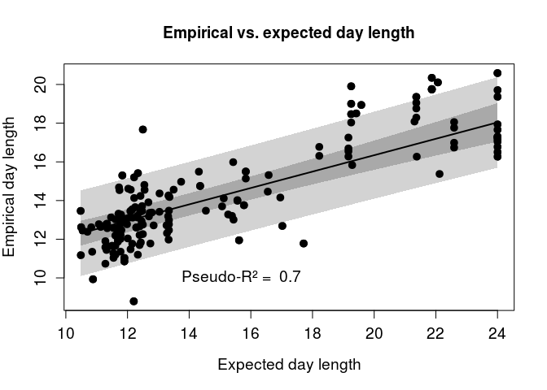

``` r
#this plot could be used as inlay for CDL~degN plot
```

slope and winter variability/predictability
-------------------------------------------

This is the main part of the study. slopes is expected to correlate with variability and predictability. predictability is here defined as sd(slopes) of temperature right before winter onset. The colour of noise approach is considered exploratory and in a different section.

### forest plot of slopes estimates

``` r
slopes$real_ses<-1/slopes$b_se
x<-mydeffor(x=slopes$b,sei=slopes$real_ses,annotate=F,pch=22,col=1,xlim=c(-100,500),alim=c(-80,500),bg=1:3,slab=NA,cex=1,rows=nrow(slopes):1, main = "Forest plot of slope estimates (from DRC)",xlab="Slopes") #rows=nrow:1 because it plots the data in reverse order
points(x=x[[9]],y=1:nrow(slopes),col=1,bg=slopes$col[nrow(slopes):1],pch=22,cex=x[[10]]+0.1)
#draw line for diff orders
cums<-cumsum(as.numeric(n))
abline(h=cums+0.5,lty=2,lwd=0.5)#draw line for diff orders

#print labels on left side, 1 for each order
#first, calculate y-value: midpoint of each order
cums<-c(0,cums)
c2<-NA
for(i in 1:(length(cums)-1)){
  c2[i]<-mean(c(cums[i],cums[i+1]))
}
text(x=-75,y=c2,labels=names(n),pos=4,cex=0.8)
```

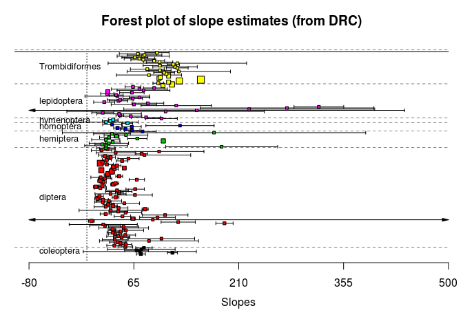

``` r
hist(slopes$real_ses,breaks=100)
```


``` r
#plot inverse of untransformed s.e.
plot(NA,xlim=c(0,nrow(slopes)),ylim=c(0,3),main = "influence of data points with untransformed s.e.")
segments(x0=1:nrow(slopes),y0=rep(0,nrow(slopes)),x1=1:nrow(slopes),y1=1/slopes$real_ses,col=slopes$col,lwd=1.5)
abline(h=0.15,lty=3)
abline(h=1.5)
abline(h=0.015)
```


``` r
#there are 5 studies that have less than 1/10th of the median influence, nad thre are 6 studies that are more than 10 times as influential as the median. both are okay I think

#alternative: sqrt-transformed ses
slopes$expses<-sqrt(slopes$real_ses) # nope that does not make sense
#keeps the name because easier coding

#plot exp(s.e)
plot(NA,xlim=c(0,nrow(slopes)),ylim=c(0,1),main = "influence of data points with exp(s.e.)",xaxt="n",xlab="",ylab = "Influence")
segments(x0=1:nrow(slopes),y0=rep(0,nrow(slopes)),x1=1:nrow(slopes),y1=1/slopes$expses,col=slopes$col,lwd=1.5)
```


``` r
#this weighs the studies with nearly infinte s.e. way too strongly (0.1)
```

The standard errors are fine as they are.

### model slopes ~ variability \* predictability

``` r
slopes_vp.f<-rma.mv(yi = b ~ sd_winter * p, V = real_ses, random = ~1|order/g/s/study, data = slopes,test="t")
```

    ## Warning in rma.mv(yi = b ~ sd_winter * p, V = real_ses, random = ~1 |
    ## order/g/s/study, : Rows with NAs omitted from model fitting.

``` r
summary(slopes_vp.f) # species has no variance explained
```

    ## 
    ## Multivariate Meta-Analysis Model (k = 159; method: REML)
    ## 
    ##     logLik    Deviance         AIC         BIC        AICc  
    ## -9286.7875  18573.5750  18589.5750  18613.9224  18590.5613  
    ## 
    ## Variance Components: 
    ## 
    ##                estim     sqrt  nlvls  fixed           factor
    ## sigma^2.1   176.8646  13.2990      7     no            order
    ## sigma^2.2  2088.4541  45.6996     20     no          order/g
    ## sigma^2.3     0.0010   0.0309     26     no        order/g/s
    ## sigma^2.4   378.8072  19.4630     30     no  order/g/s/study
    ## 
    ## Test for Residual Heterogeneity: 
    ## QE(df = 155) = 61618.8050, p-val < .0001
    ## 
    ## Test of Moderators (coefficient(s) 2:4): 
    ## F(df1 = 3, df2 = 155) = 160.8974, p-val < .0001
    ## 
    ## Model Results:
    ## 
    ##              estimate       se      tval    pval     ci.lb     ci.ub     
    ## intrcpt       78.6290  12.6580    6.2118  <.0001   53.6245  103.6335  ***
    ## sd_winter     -1.4898   0.1326  -11.2353  <.0001   -1.7518   -1.2279  ***
    ## p            -10.8135   0.7774  -13.9107  <.0001  -12.3491   -9.2779  ***
    ## sd_winter:p    1.4508   0.0862   16.8316  <.0001    1.2806    1.6211  ***
    ## 
    ## ---
    ## Signif. codes:  0 '***' 0.001 '**' 0.01 '*' 0.05 '.' 0.1 ' ' 1

``` r
#profile(slopes_vp.f, sigma2=1)#order
#profile(slopes_vp.f, sigma2=2)#order/g
#profile(slopes_vp.f, sigma2=3)#order/g/s #flat
#profile(slopes_vp.f, sigma2=4)#order/g/s/study

slopes_vp.s<-rma.mv(yi = b ~ sd_winter * p, V = real_ses, random = ~1|order/g/study, data = slopes,test="t")
```

    ## Warning in rma.mv(yi = b ~ sd_winter * p, V = real_ses, random = ~1 |
    ## order/g/study, : Rows with NAs omitted from model fitting.

``` r
summary(slopes_vp.s) # species has no variance explained
```

    ## 
    ## Multivariate Meta-Analysis Model (k = 159; method: REML)
    ## 
    ##     logLik    Deviance         AIC         BIC        AICc  
    ## -9286.7875  18573.5750  18587.5750  18608.8790  18588.3369  
    ## 
    ## Variance Components: 
    ## 
    ##                estim     sqrt  nlvls  fixed         factor
    ## sigma^2.1   176.8510  13.2985      7     no          order
    ## sigma^2.2  2088.5018  45.7001     20     no        order/g
    ## sigma^2.3   378.7934  19.4626     30     no  order/g/study
    ## 
    ## Test for Residual Heterogeneity: 
    ## QE(df = 155) = 61618.8050, p-val < .0001
    ## 
    ## Test of Moderators (coefficient(s) 2:4): 
    ## F(df1 = 3, df2 = 155) = 160.8974, p-val < .0001
    ## 
    ## Model Results:
    ## 
    ##              estimate       se      tval    pval     ci.lb     ci.ub     
    ## intrcpt       78.6291  12.6580    6.2118  <.0001   53.6247  103.6335  ***
    ## sd_winter     -1.4898   0.1326  -11.2353  <.0001   -1.7518   -1.2279  ***
    ## p            -10.8135   0.7774  -13.9107  <.0001  -12.3491   -9.2779  ***
    ## sd_winter:p    1.4508   0.0862   16.8316  <.0001    1.2806    1.6211  ***
    ## 
    ## ---
    ## Signif. codes:  0 '***' 0.001 '**' 0.01 '*' 0.05 '.' 0.1 ' ' 1

``` r
#profile(slopes_vp.s, sigma2=1)#order
#profile(slopes_vp.s, sigma2=2)#order/g
#profile(slopes_vp.s, sigma2=3)#order/g/study #fine
```

### results (without plotting)

The same model as for CDL can be used

``` r
slopesbackup<-slopes
slopes<-slopes[!is.na(slopes$b),]
slopes<-slopes[!is.na(slopes$p),]
rmamod_nested<-slopes_vp.s
summary(rmamod_nested)
```

    ## 
    ## Multivariate Meta-Analysis Model (k = 159; method: REML)
    ## 
    ##     logLik    Deviance         AIC         BIC        AICc  
    ## -9286.7875  18573.5750  18587.5750  18608.8790  18588.3369  
    ## 
    ## Variance Components: 
    ## 
    ##                estim     sqrt  nlvls  fixed         factor
    ## sigma^2.1   176.8510  13.2985      7     no          order
    ## sigma^2.2  2088.5018  45.7001     20     no        order/g
    ## sigma^2.3   378.7934  19.4626     30     no  order/g/study
    ## 
    ## Test for Residual Heterogeneity: 
    ## QE(df = 155) = 61618.8050, p-val < .0001
    ## 
    ## Test of Moderators (coefficient(s) 2:4): 
    ## F(df1 = 3, df2 = 155) = 160.8974, p-val < .0001
    ## 
    ## Model Results:
    ## 
    ##              estimate       se      tval    pval     ci.lb     ci.ub     
    ## intrcpt       78.6291  12.6580    6.2118  <.0001   53.6247  103.6335  ***
    ## sd_winter     -1.4898   0.1326  -11.2353  <.0001   -1.7518   -1.2279  ***
    ## p            -10.8135   0.7774  -13.9107  <.0001  -12.3491   -9.2779  ***
    ## sd_winter:p    1.4508   0.0862   16.8316  <.0001    1.2806    1.6211  ***
    ## 
    ## ---
    ## Signif. codes:  0 '***' 0.001 '**' 0.01 '*' 0.05 '.' 0.1 ' ' 1

``` r
#comparing to lmes
summary(lme(b~sd_winter*p, random =~ 1|order/g/study,data=slopes,weights=~real_ses))#different (better) df estimate, different coefs but same direction
```

    ## Linear mixed-effects model fit by REML
    ##  Data: slopes 
    ##        AIC      BIC   logLik
    ##   1586.098 1610.445 -785.049
    ## 
    ## Random effects:
    ##  Formula: ~1 | order
    ##         (Intercept)
    ## StdDev:    9.500497
    ## 
    ##  Formula: ~1 | g %in% order
    ##         (Intercept)
    ## StdDev:    25.31393
    ## 
    ##  Formula: ~1 | study %in% g %in% order
    ##         (Intercept) Residual
    ## StdDev:    13.50513 12.17641
    ## 
    ## Variance function:
    ##  Structure: fixed weights
    ##  Formula: ~real_ses 
    ## Fixed effects: b ~ sd_winter * p 
    ##                 Value Std.Error  DF   t-value p-value
    ## (Intercept)  76.43768 17.001150 126  4.496030  0.0000
    ## sd_winter    -0.95014  1.539252 126 -0.617273  0.5382
    ## p           -10.85916  9.218408 126 -1.177986  0.2410
    ## sd_winter:p   0.83087  0.980870 126  0.847072  0.3986
    ##  Correlation: 
    ##             (Intr) sd_wnt p     
    ## sd_winter   -0.784              
    ## p           -0.792  0.845       
    ## sd_winter:p  0.692 -0.945 -0.873
    ## 
    ## Standardized Within-Group Residuals:
    ##         Min          Q1         Med          Q3         Max 
    ## -2.97457079 -0.45913305 -0.06693459  0.35764873  4.74825667 
    ## 
    ## Number of Observations: 159
    ## Number of Groups: 
    ##                   order            g %in% order study %in% g %in% order 
    ##                       7                      20                      30

``` r
#1. estimate +ci
confint(rmamod_nested,fixed=T,random=F)
```

    ## 
    ##             estimate    ci.lb    ci.ub
    ## intrcpt      78.6291  53.6247 103.6335
    ## sd_winter    -1.4898  -1.7518  -1.2279
    ## p           -10.8135 -12.3491  -9.2779
    ## sd_winter:p   1.4508   1.2806   1.6211

``` r
#2. I² 
W <- diag(1/slopes$real_ses)
X <- model.matrix(rmamod_nested)
P <- W - W %*% X %*% solve(t(X) %*% W %*% X) %*% t(X) %*% W #generalized calculation of I² as described in http://www.metafor-project.org/doku.php/tips:i2_multilevel_multivariate
#overall I² (using sum of sigmas)

100 * sum(rmamod_nested$sigma2) / (sum(rmamod_nested$sigma2) + (rmamod_nested$k-rmamod_nested$p)/sum(diag(P)))
```

    ## [1] 99.86128

``` r
#I² of each level
round(100 * rmamod_nested$sigma2 / (sum(rmamod_nested$sigma2) + (rmamod_nested$k-rmamod_nested$p)/sum(diag(P))),4)
```

    ## [1]  6.6791 78.8763 14.3059

``` r
#99% heterogeneity, 79% due to genus. though not sure whehter calculation works for interaction


#3. forest plot #this version plots predictions + CI as whiskers
#forest plot sorted by order 
yi<-rmamod_nested$yi
vicorr<-slopes[nrow(slopes):1,"real_ses"]

ci.ub<-yi + qnorm(0.05/2, lower.tail = FALSE) * sqrt(vicorr)
ci.lb<-yi - qnorm(0.05/2, lower.tail = FALSE) * sqrt(vicorr)
ci.ub<-ci.ub[length(ci.ub):1]
ci.lb<-ci.lb[length(ci.lb):1]
#this time there was no transformation of s.e. so the normal forest plot function can be used 

forest.rma(rmamod_nested,addcred=T,addfit=T,cex.axis=1,cex.lab=2,cex=1,slab=NA,annotate=F,order=1:170, xlim=c(-90,300),main = "Forest plot, sorted by phylogeny",xlab = "slope",alim=c(-100,350))

#needs cex of each point
text(x=-30,y=c2,labels=names(n),pos=4,cex=0.8)
abline(h=cums+0.5,lty=2,lwd=0.5)#draw line for diff orders
points(rmamod_nested$yi,159:1,bg=slopes$col,cex=1,pch=22)
```


``` r
#4. pseudo-R^2
pseudo_nested.s<-rma.mv(yi = b ~ 1, V = real_ses, random = ~1|order/g/study,data = slopes,test="t")
rsq<-(sum(pseudo_nested.s$sigma2)-sum(rmamod_nested$sigma2))/sum(pseudo_nested.s$sigma2)
#0
```

### plot result, seperately for b~v, b~p models

``` r
vmod<-rma.mv(yi = b ~ sd_winter, V = real_ses, random = ~1|order/g/study, data = slopes,test="t") #actually the full model would sort of work here, but keeping this for consistency
summary(vmod)
```

    ## 
    ## Multivariate Meta-Analysis Model (k = 159; method: REML)
    ## 
    ##     logLik    Deviance         AIC         BIC        AICc  
    ## -9432.6114  18865.2228  18875.2228  18890.5040  18875.6201  
    ## 
    ## Variance Components: 
    ## 
    ##                estim     sqrt  nlvls  fixed         factor
    ## sigma^2.1   158.4825  12.5890      7     no          order
    ## sigma^2.2  2091.4775  45.7327     20     no        order/g
    ## sigma^2.3   333.8794  18.2724     30     no  order/g/study
    ## 
    ## Test for Residual Heterogeneity: 
    ## QE(df = 157) = 87886.1864, p-val < .0001
    ## 
    ## Test of Moderators (coefficient(s) 2): 
    ## F(df1 = 1, df2 = 157) = 199.2478, p-val < .0001
    ## 
    ## Model Results:
    ## 
    ##            estimate       se     tval    pval    ci.lb    ci.ub     
    ## intrcpt     63.3571  12.3899   5.1136  <.0001  38.8848  87.8294  ***
    ## sd_winter    0.6127   0.0434  14.1155  <.0001   0.5270   0.6985  ***
    ## 
    ## ---
    ## Signif. codes:  0 '***' 0.001 '**' 0.01 '*' 0.05 '.' 0.1 ' ' 1

``` r
#6. plot prediction + credible interval
ps<-predict.rma(vmod)

normal<- data.frame(slopes$sd_winter,ps$cr.lb,ps$ci.lb)
names(normal)<-c("sd_winter","cr","ci")
normal<-normal[order(normal$sd_winter),]
reversed<-data.frame(slopes$sd_winter,ps$cr.ub,ps$ci.ub)
names(reversed)<-c("sd_winter","cr","ci")
reversed<-reversed[order(reversed$sd_winter),]
reversed<-reversed[nrow(reversed):1,]
combined<-rbind(normal,reversed)
names(combined)<-c("sd_winter","cr","ci")

plot(x=slopes$sd_winter,y=slopes$b,pch=21,cex=0.8,col=NA, bg=slopes$col,main = "Physiological determination vs. winter variability", xlab = "Sd (winter onset)", ylab = "slope of diapause timing")
legend("topleft",pch = 21, pt.bg = 1:7,legend=unique(slopes$order)[7:1],cex=0.8)
polygon(x=combined$sd_winter, y=combined$cr,col="lightgrey",border=NA)
polygon(x=combined$sd_winter, y=combined$ci,col="darkgrey",border=NA)
lines(x=slopes$sd_winter,y=ps$pred,lwd=2,col="lightgray")
points(x=slopes$sd_winter,y=slopes$b,pch=21,cex=0.8,col=NA,bg=slopes$col)
#ci.lb<-ci.lb[length(ci.lb):1]
#ci.ub<-ci.ub[length(ci.ub):1]
#segments(x0=slopes$sd_winter[order(slopes$sd_winter)],x1=slopes$sd_winter[order(slopes$sd_winter)],y0=ci.lb,y1=ci.ub)

#segments(x0=slopes$sd_winter,x1=slopes$sd_winter,y0=slopes$b+slopes$real_ses,y1=slopes$b-slopes$real_ses)
axis(1)
s_est<-confint(vmod,fixed=T,random=F)$fixed[2,1]
s_est<-round(s_est,2)
rsq<-(sum(pseudo_nested.s$sigma2)-sum(vmod$sigma2))/sum(pseudo_nested.s$sigma2)
rsq=round(rsq,2)
text(25,250,paste("slope = ",s_est, " \npseudo-R² = ",rsq),cex=0.8)
```

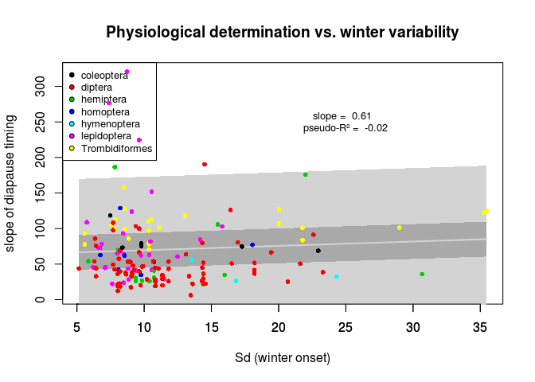

``` r
##################

pmod<-rma.mv(yi = b ~ p, V = real_ses, random = ~1|order/g/study, data = slopes,test="t") 
summary(pmod)
```

    ## 
    ## Multivariate Meta-Analysis Model (k = 159; method: REML)
    ## 
    ##     logLik    Deviance         AIC         BIC        AICc  
    ## -9527.0633  19054.1267  19064.1267  19079.4079  19064.5240  
    ## 
    ## Variance Components: 
    ## 
    ##                estim     sqrt  nlvls  fixed         factor
    ## sigma^2.1   109.8425  10.4806      7     no          order
    ## sigma^2.2  2128.7543  46.1384     20     no        order/g
    ## sigma^2.3   286.4964  16.9262     30     no  order/g/study
    ## 
    ## Test for Residual Heterogeneity: 
    ## QE(df = 157) = 61988.0972, p-val < .0001
    ## 
    ## Test of Moderators (coefficient(s) 2): 
    ## F(df1 = 1, df2 = 157) = 9.7449, p-val = 0.0021
    ## 
    ## Model Results:
    ## 
    ##          estimate       se     tval    pval    ci.lb    ci.ub     
    ## intrcpt   72.6980  11.9740   6.0713  <.0001  49.0471  96.3490  ***
    ## p         -1.3355   0.4278  -3.1217  0.0021  -2.1805  -0.4905   **
    ## 
    ## ---
    ## Signif. codes:  0 '***' 0.001 '**' 0.01 '*' 0.05 '.' 0.1 ' ' 1

``` r
#6. plot prediction + credible interval
ps<-predict.rma(pmod)

normal<- data.frame(slopes$p,ps$cr.lb,ps$ci.lb)
names(normal)<-c("p","cr","ci")
normal<-normal[order(normal$p),]
reversed<-data.frame(slopes$p,ps$cr.ub,ps$ci.ub)
names(reversed)<-c("p","cr","ci")
reversed<-reversed[order(reversed$p),]
reversed<-reversed[nrow(reversed):1,]
combined<-rbind(normal,reversed)
names(combined)<-c("p","cr","ci")

plot(x=slopes$p,y=slopes$b,pch=21,cex=0.8,col=NA, bg=slopes$col,main = "Physiological determination vs. winter predictability", xlab = "Unpredictability(slopes)", ylab = "slope of diapause timing")
legend("topright",pch = 21, pt.bg = 1:7,legend=unique(slopes$order)[7:1],cex=0.8)
polygon(x=combined$p, y=combined$cr,col="lightgrey",border=NA)
polygon(x=combined$p, y=combined$ci,col="darkgrey",border=NA)
lines(x=slopes$p,y=ps$pred,lwd=2,col="lightgray")
points(x=slopes$p,y=slopes$b,pch=21,cex=0.8,col=NA,bg=slopes$col)
#ci.lb<-ci.lb[length(ci.lb):1]
#ci.ub<-ci.ub[length(ci.ub):1]
#segments(x0=slopes$p[order(slopes$p)],x1=slopes$p[order(slopes$p)],y0=ci.lb,y1=ci.ub)

#segments(x0=slopes$p,x1=slopes$p,y0=slopes$b+slopes$real_ses,y1=slopes$b-slopes$real_ses)
axis(1)
s_est<-confint(vmod,fixed=T,random=F)$fixed[2,1]
s_est<-round(s_est,2)
rsq<-(sum(pseudo_nested.s$sigma2)-sum(pmod$sigma2))/sum(pseudo_nested.s$sigma2)
rsq=round(rsq,2)
text(1.2,300,paste("slope = ",s_est, " \npseudo-R² = ",rsq),cex=0.8)
```

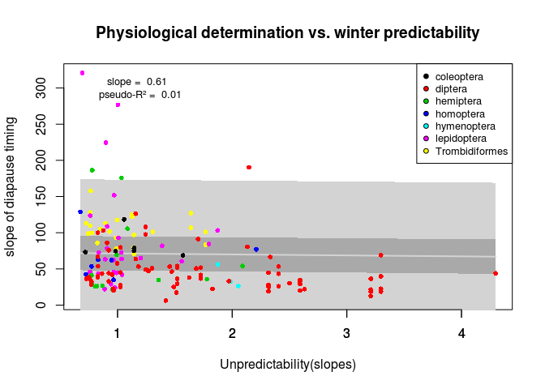

exploratory stuff
-----------------

### correlation of d with winter variability/predictability

``` r
#get studies with meaningful d estimate
x<-slopes[slopes$study %in% c("1","5","6","6b","22","27","33","35","37","45","53","55","56","60"),]
x<-droplevels(x)
plot(x$d~x$sd_winter,pch=22,bg=x$study)
```


``` r
plot(x$d~x$p,pch=22,bg=x$study)
```


``` r
dmod<-rma.mv(yi = b ~ sd_winter, V = real_ses, random = ~1|order/g/study, data = slopes,test="t") 
```

#### forest plot and inversion

``` r
x$real_ses<-1/x$d_se
dfe<-mydeffor(x=x$d,sei=x$real_ses,annotate=F,pch=22,col=1,xlim=c(0,1.2),alim=c(0,1.2),bg=1:3,slab=NA,cex=1,rows=nrow(x):1, main = "Forest plot of upper limit estimates (from DRC)",xlab="d") #rows=nrow:1 because it plots the data in reverse order
points(x=dfe[[9]],y=1:nrow(x),col=1,bg=x$col[nrow(x):1],pch=22,cex=dfe[[10]]+0.1)
```


``` r
#draw line for diff orders

#plot inverse of untransformed s.e.
plot(NA,xlim=c(0,nrow(x)),ylim=c(0,30000),main = "influence of data points with untransformed s.e.")
segments(x0=1:nrow(x),y0=rep(0,nrow(x)),x1=1:nrow(x),y1=1/x$real_ses,col=x$col,lwd=1.5)
```


``` r
#alternative
x$expses<-exp(x$real_ses) 
plot(NA,xlim=c(0,nrow(x)),ylim=c(0,1.3),main = "influence of data points transformed s.e.")
segments(x0=1:nrow(x),y0=rep(0,nrow(x)),x1=1:nrow(x),y1=1/x$expses,col=x$col,lwd=1.5)
```


``` r
x<-x[order(x$sd_winter),]
 plot(x$d~x$sd_winter,pch=22,bg=x$study,type="p")
for(i in unique(x$study)){
  a<-x[x$study==i,]
 
  lines(a$sd_winter,a$d,col=a$study)
}
```

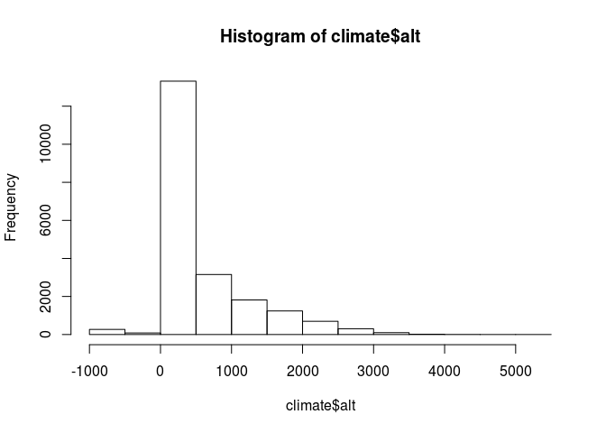

``` r
 x<-x[order(x$p),]
 plot(x$d~x$p,pch=22,bg=x$study,type="p")
for(i in unique(x$study)){
  a<-x[x$study==i,]
 
  lines(a$p,a$d,col=a$study)
}
```


not much of a pattern here

``` r
plot(slopes$b~slopes$beta)
```

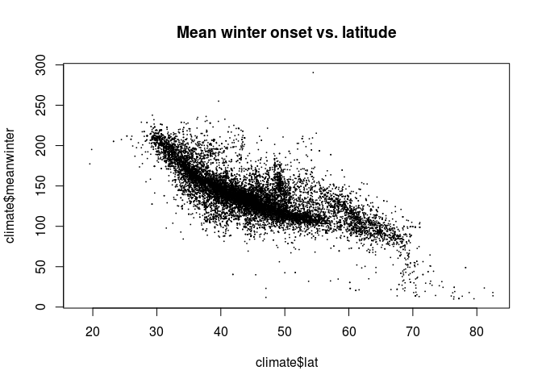

not much of a pattern either
